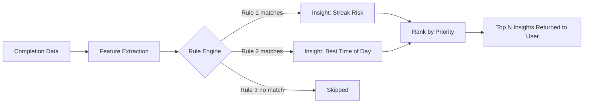
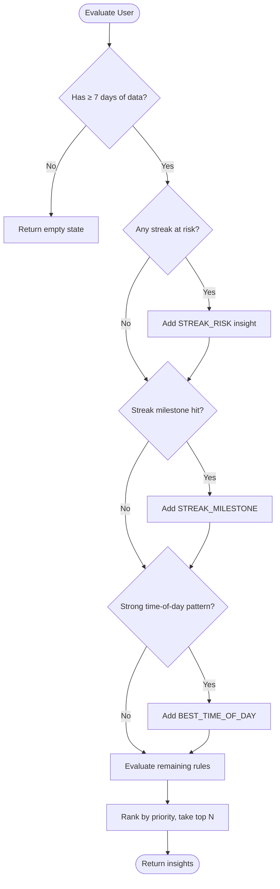

# AI_INSIGHTS.md

# AI Insights Engine — HabitFlow

HabitFlow's "AI Insights" are generated by a **rule-based engine**, not a machine learning model, in v1. This keeps the system explainable, fast, and free of training-data requirements while still delivering meaningful, personalized feedback. Machine learning is planned for a future version (see Section 5).

---

## 1. How It Works

The `InsightEngine` runs periodically (daily, on dashboard load, or on-demand) and evaluates a user's prepared feature set (see [`ANALYTICS.md`](./ANALYTICS.md) §9) against an ordered set of **rules**. Each rule that matches produces a human-readable message. The top N (typically 3–5) highest-priority matched insights are shown to the user.

---

## 2. Rules

| Rule ID | Condition | Message Template |
|---|---|---|
| `STREAK_RISK` | Habit not completed today AND yesterday was completed AND currentStreak ≥ 3 | "Your '{habit}' streak may break — complete it today to keep your {streak}-day streak alive." |
| `STREAK_MILESTONE` | currentStreak just crossed 7, 30, 100 | "🎉 You've hit a {n}-day streak on '{habit}'! Keep it going." |
| `BEST_TIME_OF_DAY` | ≥ 70% of completions for a habit occur in one time bucket (morning/afternoon/evening) over last 30 days | "You complete '{habit}' most consistently in the {timeOfDay}." |
| `WEEKEND_DROPOFF` | Completion rate on weekends < 50% of weekday rate | "Your consistency drops on weekends. Consider a lighter weekend goal for '{habit}'." |
| `CATEGORY_STRUGGLE` | A category's average HabitScore < 40 while others are ≥ 70 | "Habits in '{category}' are falling behind your other goals. Want to simplify them?" |
| `RECOVERY_ENCOURAGEMENT` | Streak reset occurred but user resumed within 3 days | "You bounced back quickly after missing '{habit}' — that's what builds long-term consistency." |
| `OVERLOAD_WARNING` | User has ≥ 8 active daily habits AND average HabitScore < 50 | "You may be tracking too many habits at once. Consider focusing on your top 3." |
| `PRODUCTIVITY_TREND_UP` | ProductivityScore increased ≥ 10 points week-over-week | "Your productivity score is up {n} points this week — great momentum!" |
| `INACTIVITY_NUDGE` | No completions logged in 3+ days across all habits | "It's been a few days since your last check-in. A small step today counts." |

---

## 3. Decision Tree (Simplified)

---

## 4. Examples

**Scenario:** Sam has a "Morning Run" habit with a 5-day streak, last completed yesterday, not yet completed today (currently 6 PM).

→ `STREAK_RISK` fires:
> "Your 'Morning Run' streak may break — complete it today to keep your 5-day streak alive."

**Scenario:** Olivia's "Stretching" habit shows 80% of completions logged between 6–8 AM over the last 30 days.

→ `BEST_TIME_OF_DAY` fires:
> "You complete 'Stretching' most consistently in the morning."

**Scenario:** A user is tracking 9 active daily habits with an average HabitScore of 42.

→ `OVERLOAD_WARNING` fires:
> "You may be tracking too many habits at once. Consider focusing on your top 3."

---

## 5. Recommendation Logic

Beyond descriptive insights, a lightweight recommendation layer suggests actions:

| Trigger | Recommendation |
|---|---|
| `OVERLOAD_WARNING` fired | Suggest archiving lowest-performing habits |
| `WEEKEND_DROPOFF` fired | Suggest reducing weekly target or adding a weekend-specific reminder |
| `CATEGORY_STRUGGLE` fired | Suggest breaking the habit into a smaller daily action |
| Repeated `STREAK_RISK` for same habit (3+ times/month) | Suggest changing the reminder time |

Recommendations are surfaced as optional action buttons on insight cards (e.g., "Adjust reminder time →").

---

## 6. Future ML Improvements

Planned evolution beyond rule-based logic (see [`ROADMAP.md`](./ROADMAP.md)):

1. **Personalized reminder timing** — a lightweight model predicting the optimal reminder time per user per habit based on historical completion timestamps, replacing the static time-of-day bucket rule.
2. **Churn prediction** — classify users at risk of app abandonment based on engagement decay patterns, triggering targeted re-engagement flows.
3. **Habit success prediction** — estimate the likelihood a newly created habit will be sustained past 30 days based on similarity to the user's historical habit patterns, offering setup suggestions (e.g., smaller starting frequency).
4. **Clustering-based insight generation** — group users into behavioral cohorts to generate more nuanced, population-informed insights rather than fixed thresholds.
5. **Natural language insight generation** — use an LLM to phrase insights more naturally and contextually, while keeping the underlying rule/feature evaluation deterministic and explainable.

The rule engine is intentionally designed with a clean feature-extraction boundary (see [`ANALYTICS.md`](./ANALYTICS.md) §9) so it can be swapped for or augmented by ML models without redesigning the data pipeline.

Related: [`ANALYTICS.md`](./ANALYTICS.md), [`ROADMAP.md`](./ROADMAP.md), [`API.md`](./API.md)
