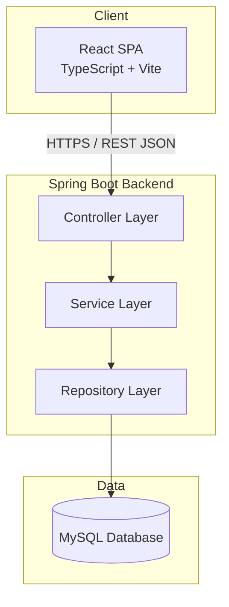
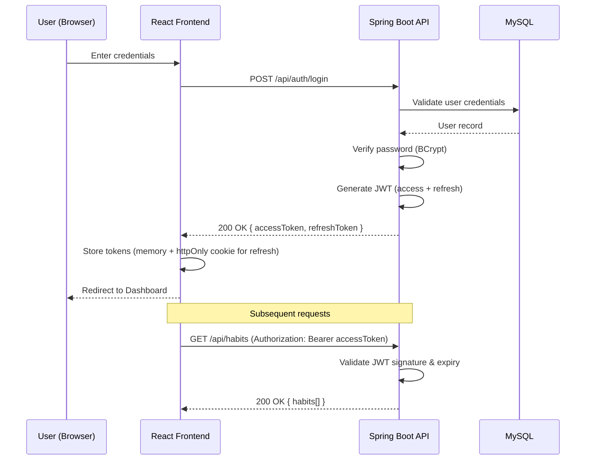
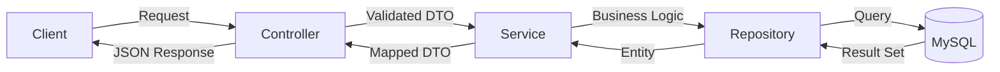
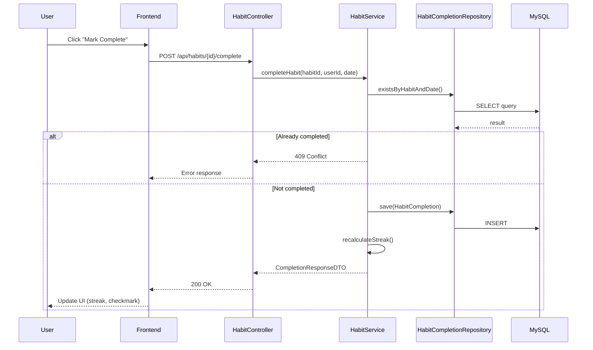
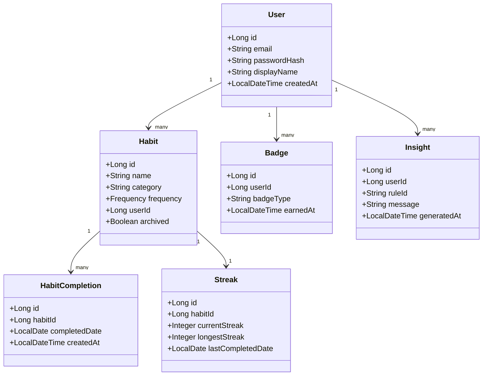
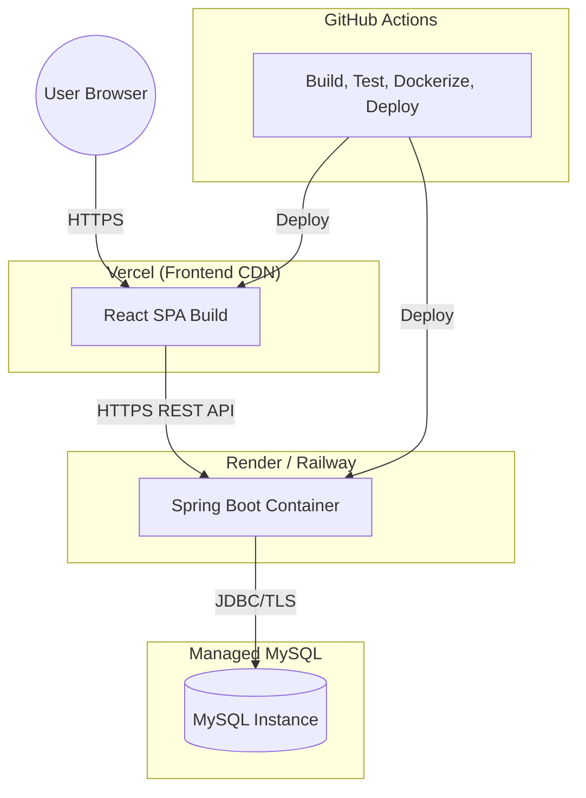

# ARCHITECTURE.md

# Architecture — HabitFlow

## 1. High-Level Architecture

HabitFlow follows a decoupled client-server architecture: a React SPA frontend communicates with a Spring Boot REST API backend over HTTPS, backed by a MySQL relational database.



---

## 2. Frontend

- **Pattern:** Component-driven SPA with feature-based folder structure.
- **State:** Server state via React Query; local/UI state via React hooks/context.
- **Routing:** React Router with protected routes guarded by JWT presence/validity.
- **Communication:** Axios client with interceptors for attaching JWT and handling 401 refresh logic.

Full details in [`FRONTEND.md`](./FRONTEND.md).

---

## 3. Backend

- **Pattern:** Layered architecture (Controller → Service → Repository) following MVC and Repository Pattern.
- **DTO Pattern:** Entities are never exposed directly; DTOs mediate all API input/output.
- **Cross-cutting concerns:** Centralized exception handling (`@ControllerAdvice`), request validation, logging via AOP-style interceptors.

Full details in [`BACKEND.md`](./BACKEND.md).

---

## 4. Database

MySQL stores users, habits, completions, streaks, badges, and reports. See [`DATABASE.md`](./DATABASE.md) for full schema, ER diagram, and indexing strategy.

---

## 5. Authentication Flow



---

## 6. API Flow



---

## 7. Sequence Diagram — Habit Completion



---

## 8. Component Diagram

```mermaid
graph TD
    subgraph Frontend Components
        Dashboard --> HabitList
        Dashboard --> StreakWidget
        Dashboard --> HeatmapCalendar
        Dashboard --> InsightsPanel
        HabitList --> HabitCard
        AnalyticsPage --> ChartPanel
        AnalyticsPage --> ReportExport
    end
    subgraph Backend Components
        AuthController --> AuthService
        HabitController --> HabitService
        AnalyticsController --> AnalyticsService
        InsightController --> InsightEngine
        HabitService --> HabitRepository
        AnalyticsService --> HabitCompletionRepository
        InsightEngine --> RuleSet
    end
    Frontend Components -->|REST API| Backend Components
```

---

## 9. Class Diagram (Backend Core Domain)



---

## 10. Folder Structure

```
backend/src/main/java/com/habitflow/
├── controller/
│   ├── AuthController.java
│   ├── HabitController.java
│   ├── AnalyticsController.java
│   ├── InsightController.java
│   └── ProfileController.java
├── service/
│   ├── AuthService.java
│   ├── HabitService.java
│   ├── AnalyticsService.java
│   └── InsightEngine.java
├── repository/
│   ├── UserRepository.java
│   ├── HabitRepository.java
│   ├── HabitCompletionRepository.java
│   └── StreakRepository.java
├── entity/
├── dto/
│   ├── request/
│   └── response/
├── security/
│   ├── JwtTokenProvider.java
│   ├── JwtAuthFilter.java
│   └── SecurityConfig.java
├── exception/
│   ├── GlobalExceptionHandler.java
│   └── custom exceptions
└── config/
```

---

## 11. Request Lifecycle

1. Client sends HTTPS request with `Authorization: Bearer <JWT>` header.
2. `JwtAuthFilter` intercepts, validates token, sets `SecurityContext`.
3. Request reaches `@RestController`, which validates the request DTO (`@Valid`).
4. Controller delegates to `Service` layer for business logic.
5. Service calls `Repository` layer (Spring Data JPA) for persistence operations.
6. Service maps entity results to response DTOs (MapStruct).
7. Controller returns JSON response with appropriate HTTP status.
8. `GlobalExceptionHandler` intercepts any thrown exceptions and returns standardized error responses.

---

## 12. Deployment Diagram



---

## 13. Data Flow

1. **Ingestion:** User actions (habit creation, completion) flow from UI → API → DB.
2. **Aggregation:** Nightly/on-demand jobs compute streaks, productivity scores, and heatmap data from raw completion records.
3. **Insight Generation:** `InsightEngine` reads aggregated analytics and evaluates rule set to produce insights.
4. **Presentation:** Frontend queries aggregated analytics endpoints (not raw data) for dashboard rendering, reducing client-side computation.

---

## 14. Scalability

- **Stateless backend:** JWT-based auth allows horizontal scaling of API instances behind a load balancer.
- **Database indexing:** Composite indexes on `(habit_id, completed_date)` for fast streak/analytics queries (see [`DATABASE.md`](./DATABASE.md)).
- **Caching:** Read-heavy analytics endpoints can be cached (e.g., Redis) with short TTLs.
- **Async processing:** Report generation and badge evaluation can be offloaded to background jobs/message queues as usage grows.
- **CDN:** Frontend static assets served via Vercel's global CDN.

Related: [`DEPLOYMENT.md`](./DEPLOYMENT.md), [`DATABASE.md`](./DATABASE.md), [`BACKEND.md`](./BACKEND.md)
