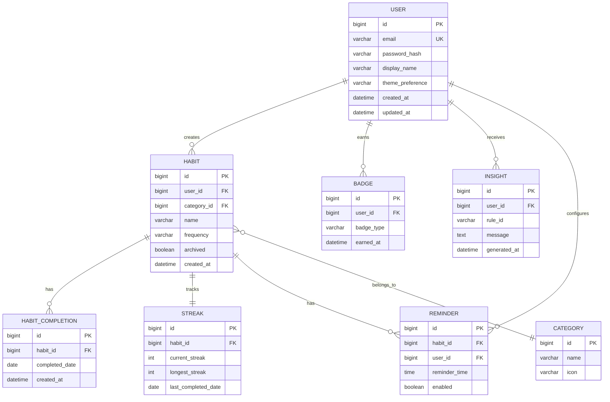

# DATABASE.md

# Database Design — HabitFlow

## 1. ER Diagram



---

## 2. Tables

### `users`
| Column | Type | Constraints |
|---|---|---|
| id | BIGINT | PK, AUTO_INCREMENT |
| email | VARCHAR(255) | UNIQUE, NOT NULL |
| password_hash | VARCHAR(255) | NOT NULL |
| display_name | VARCHAR(100) | NOT NULL |
| theme_preference | ENUM('LIGHT','DARK') | DEFAULT 'LIGHT' |
| created_at | DATETIME | NOT NULL, DEFAULT CURRENT_TIMESTAMP |
| updated_at | DATETIME | ON UPDATE CURRENT_TIMESTAMP |

### `categories`
| Column | Type | Constraints |
|---|---|---|
| id | BIGINT | PK, AUTO_INCREMENT |
| name | VARCHAR(50) | UNIQUE, NOT NULL |
| icon | VARCHAR(50) | NULLABLE |

### `habits`
| Column | Type | Constraints |
|---|---|---|
| id | BIGINT | PK, AUTO_INCREMENT |
| user_id | BIGINT | FK → users.id, NOT NULL |
| category_id | BIGINT | FK → categories.id, NULLABLE |
| name | VARCHAR(150) | NOT NULL |
| frequency | ENUM('DAILY','WEEKLY') | NOT NULL |
| target_per_week | TINYINT | NULLABLE (for weekly habits) |
| archived | BOOLEAN | DEFAULT FALSE |
| created_at | DATETIME | NOT NULL, DEFAULT CURRENT_TIMESTAMP |

### `habit_completions`
| Column | Type | Constraints |
|---|---|---|
| id | BIGINT | PK, AUTO_INCREMENT |
| habit_id | BIGINT | FK → habits.id, NOT NULL |
| completed_date | DATE | NOT NULL |
| created_at | DATETIME | NOT NULL, DEFAULT CURRENT_TIMESTAMP |
| — | — | UNIQUE(habit_id, completed_date) |

### `streaks`
| Column | Type | Constraints |
|---|---|---|
| id | BIGINT | PK, AUTO_INCREMENT |
| habit_id | BIGINT | FK → habits.id, UNIQUE, NOT NULL |
| current_streak | INT | DEFAULT 0 |
| longest_streak | INT | DEFAULT 0 |
| last_completed_date | DATE | NULLABLE |

### `badges`
| Column | Type | Constraints |
|---|---|---|
| id | BIGINT | PK, AUTO_INCREMENT |
| user_id | BIGINT | FK → users.id, NOT NULL |
| badge_type | VARCHAR(50) | NOT NULL |
| earned_at | DATETIME | NOT NULL, DEFAULT CURRENT_TIMESTAMP |
| — | — | UNIQUE(user_id, badge_type) |

### `insights`
| Column | Type | Constraints |
|---|---|---|
| id | BIGINT | PK, AUTO_INCREMENT |
| user_id | BIGINT | FK → users.id, NOT NULL |
| rule_id | VARCHAR(50) | NOT NULL |
| message | TEXT | NOT NULL |
| generated_at | DATETIME | NOT NULL, DEFAULT CURRENT_TIMESTAMP |

### `reminders`
| Column | Type | Constraints |
|---|---|---|
| id | BIGINT | PK, AUTO_INCREMENT |
| habit_id | BIGINT | FK → habits.id, NOT NULL |
| user_id | BIGINT | FK → users.id, NOT NULL |
| reminder_time | TIME | NOT NULL |
| enabled | BOOLEAN | DEFAULT TRUE |

---

## 3. Relationships

- `users 1—N habits`: a user owns many habits.
- `habits 1—N habit_completions`: each habit has many daily completion records.
- `habits 1—1 streaks`: each habit maintains exactly one streak record (updated incrementally).
- `users 1—N badges`: a user can earn many distinct badge types.
- `users 1—N insights`: generated insights are stored per user for history/audit.
- `habits N—1 categories`: many habits can belong to one category.
- `habits 1—N reminders`: a habit can have multiple reminder times configured.

---

## 4. Indexes

| Table | Index | Purpose |
|---|---|---|
| `habit_completions` | `idx_habit_date (habit_id, completed_date)` | Fast streak/analytics range queries |
| `habits` | `idx_user_id (user_id)` | Fast retrieval of a user's habits |
| `habits` | `idx_user_archived (user_id, archived)` | Filter active habits efficiently |
| `users` | `idx_email (email)` UNIQUE | Fast login lookup, enforce uniqueness |
| `insights` | `idx_user_generated (user_id, generated_at)` | Fetch latest insights per user |
| `badges` | `idx_user_badge (user_id, badge_type)` UNIQUE | Prevent duplicate badge awards |

---

## 5. Constraints

- `habit_completions(habit_id, completed_date)` — UNIQUE, prevents duplicate completion entries for the same day.
- `badges(user_id, badge_type)` — UNIQUE, prevents duplicate badge awards.
- Foreign keys use `ON DELETE CASCADE` for `habit_completions`, `streaks`, and `reminders` when a parent habit is deleted.
- `users.email` — UNIQUE and NOT NULL.
- `habits.frequency` — CHECK constraint restricting values to `DAILY` or `WEEKLY`.

---

## 6. Normalization

The schema is normalized to **Third Normal Form (3NF)**:
- All non-key attributes depend only on the primary key (no partial dependencies since all PKs are single-column surrogate keys).
- No transitive dependencies — e.g., `category name` is stored only in `categories`, referenced via `category_id` in `habits`, not duplicated.
- Derived/aggregate data (streaks, productivity scores) is intentionally denormalized into dedicated tables (`streaks`) for performance, recalculated via application logic rather than computed on every read — a deliberate trade-off documented in [`DECISIONS.md`](./DECISIONS.md).

---

## 7. Sample Data

```sql
INSERT INTO users (id, email, password_hash, display_name) VALUES
(1, 'sam@example.com', '$2a$12$hashedpassword...', 'Structured Sam');

INSERT INTO categories (id, name, icon) VALUES
(1, 'Fitness', 'dumbbell'), (2, 'Learning', 'book'), (3, 'Mindfulness', 'leaf');

INSERT INTO habits (id, user_id, category_id, name, frequency, archived) VALUES
(1, 1, 1, 'Morning Run', 'DAILY', false),
(2, 1, 2, 'Read 20 Pages', 'DAILY', false);

INSERT INTO habit_completions (habit_id, completed_date) VALUES
(1, '2026-07-20'), (1, '2026-07-21'), (1, '2026-07-22');

INSERT INTO streaks (habit_id, current_streak, longest_streak, last_completed_date) VALUES
(1, 3, 5, '2026-07-22');
```

---

## 8. Future Tables

| Table | Purpose |
|---|---|
| `teams` | Support group/organization habit tracking |
| `team_members` | Map users to teams with roles |
| `challenges` | Social accountability challenges between users |
| `ml_feature_snapshots` | Store precomputed features for future ML-based insights |
| `audit_logs` | Track sensitive account/security events |
| `notification_log` | History of sent reminders/push notifications |

Related: [`ARCHITECTURE.md`](./ARCHITECTURE.md), [`ANALYTICS.md`](./ANALYTICS.md), [`BACKEND.md`](./BACKEND.md)
