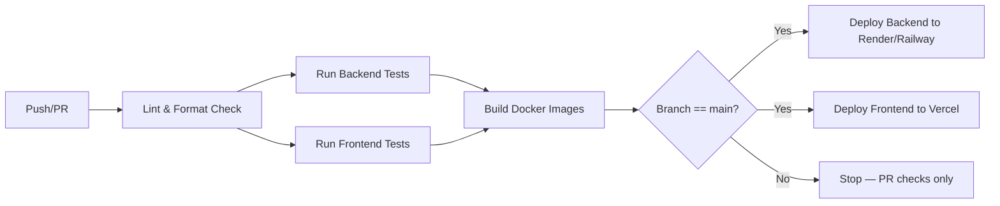

# DEPLOYMENT.md

# Deployment — HabitFlow

## 1. Docker

**Backend Dockerfile** (`backend/Dockerfile`):
```dockerfile
FROM eclipse-temurin:17-jdk-alpine AS build
WORKDIR /app
COPY . .
RUN ./mvnw clean package -DskipTests

FROM eclipse-temurin:17-jre-alpine
WORKDIR /app
COPY --from=build /app/target/habitflow-*.jar app.jar
EXPOSE 8080
ENTRYPOINT ["java", "-jar", "app.jar"]
```

**Frontend Dockerfile** (`frontend/Dockerfile`):
```dockerfile
FROM node:18-alpine AS build
WORKDIR /app
COPY package*.json ./
RUN npm ci
COPY . .
RUN npm run build

FROM nginx:alpine
COPY --from=build /app/dist /usr/share/nginx/html
EXPOSE 80
```

---

## 2. Docker Compose

```yaml
version: "3.9"
services:
  mysql:
    image: mysql:8.0
    environment:
      MYSQL_DATABASE: habitflow
      MYSQL_ROOT_PASSWORD: ${DB_ROOT_PASSWORD}
      MYSQL_USER: ${DB_USER}
      MYSQL_PASSWORD: ${DB_PASSWORD}
    ports:
      - "3306:3306"
    volumes:
      - mysql_data:/var/lib/mysql

  backend:
    build: ./backend
    depends_on:
      - mysql
    environment:
      SPRING_DATASOURCE_URL: jdbc:mysql://mysql:3306/habitflow
      SPRING_DATASOURCE_USERNAME: ${DB_USER}
      SPRING_DATASOURCE_PASSWORD: ${DB_PASSWORD}
      JWT_SECRET: ${JWT_SECRET}
    ports:
      - "8080:8080"

  frontend:
    build: ./frontend
    depends_on:
      - backend
    ports:
      - "5173:80"

volumes:
  mysql_data:
```

Run with: `docker compose up --build`

---

## 3. CI/CD

Pipeline stages (triggered on push/PR to `main`):



---

## 4. GitHub Actions

`.github/workflows/ci.yml`:
```yaml
name: CI
on:
  pull_request:
  push:
    branches: [main]

jobs:
  backend-test:
    runs-on: ubuntu-latest
    steps:
      - uses: actions/checkout@v4
      - uses: actions/setup-java@v4
        with: { java-version: '17', distribution: 'temurin' }
      - run: cd backend && ./mvnw test

  frontend-test:
    runs-on: ubuntu-latest
    steps:
      - uses: actions/checkout@v4
      - uses: actions/setup-node@v4
        with: { node-version: '18' }
      - run: cd frontend && npm ci && npm test -- --run

  deploy:
    needs: [backend-test, frontend-test]
    if: github.ref == 'refs/heads/main'
    runs-on: ubuntu-latest
    steps:
      - uses: actions/checkout@v4
      - name: Deploy Backend
        run: curl -X POST "${{ secrets.RENDER_DEPLOY_HOOK }}"
      - name: Deploy Frontend
        run: curl -X POST "${{ secrets.VERCEL_DEPLOY_HOOK }}"
```

---

## 5. Environment Variables

| Variable | Used By | Description |
|---|---|---|
| `SPRING_DATASOURCE_URL` | Backend | MySQL JDBC connection string |
| `SPRING_DATASOURCE_USERNAME` | Backend | DB username |
| `SPRING_DATASOURCE_PASSWORD` | Backend | DB password |
| `JWT_SECRET` | Backend | Signing key for JWTs |
| `JWT_ACCESS_EXPIRY` | Backend | Access token TTL (seconds) |
| `JWT_REFRESH_EXPIRY` | Backend | Refresh token TTL (seconds) |
| `CORS_ALLOWED_ORIGINS` | Backend | Comma-separated list of allowed frontend origins |
| `VITE_API_BASE_URL` | Frontend | Backend API base URL |
| `RENDER_DEPLOY_HOOK` | CI | Deploy webhook URL (GitHub secret) |
| `VERCEL_DEPLOY_HOOK` | CI | Deploy webhook URL (GitHub secret) |

All secrets are stored in GitHub Actions encrypted secrets and the hosting platform's environment variable manager — never committed to source control (see [`SECURITY.md`](./SECURITY.md) §11).

---

## 6. Production Deployment

- **Backend:** Containerized Spring Boot app deployed to Render or Railway, auto-deployed on push to `main` via deploy hook.
- **Frontend:** Vite build output deployed to Vercel's global CDN, with automatic preview deployments for pull requests.
- **Database:** Managed MySQL instance (Render/Railway/PlanetScale), automated daily backups with 30-day retention.
- **Domain/SSL:** Managed automatically by Vercel (frontend) and Render/Railway (backend), both enforcing HTTPS.

---

## 7. Monitoring

- Health check endpoint: `GET /actuator/health`, polled by the hosting platform for uptime checks.
- Application metrics exposed via Spring Boot Actuator (`/actuator/metrics`), scraped by Prometheus if configured.
- Frontend error tracking via a lightweight error boundary reporting to a logging endpoint or third-party service (e.g., Sentry).
- Alerting on elevated error rates, latency spikes, or failed deploys (via GitHub Actions notifications + hosting platform alerts).

---

## 8. Rollback Strategy

- Render/Railway retain previous successful deploys; rollback is a one-click action to the last known-good container image.
- Vercel retains all previous deployments; rollback via the Vercel dashboard or CLI (`vercel rollback`).
- Database migrations use a versioned migration tool (Flyway/Liquibase) with reversible migration scripts where feasible, allowing schema rollback alongside application rollback.
- In case of a critical production incident, the CI pipeline supports re-running a deploy from any prior successful commit SHA.

Related: [`ARCHITECTURE.md`](./ARCHITECTURE.md), [`SECURITY.md`](./SECURITY.md), [`TESTING.md`](./TESTING.md)
