# HabitFlow Project Report

<div style="page-break-after: always;"></div>

## README

# README.md

# 🧠 HabitFlow – Smart Habit Tracker with Analytics & AI Insights

HabitFlow is a full-stack web application that helps users build lasting habits, track daily progress, analyze consistency, maintain streaks, and receive intelligent, rule-based recommendations tailored to their behavior. It solves the real-world problem of people abandoning habits due to lack of motivation, visibility, and actionable feedback.


---

## 📖 Project Overview

Most habit-tracking apps stop at simple checkboxes. HabitFlow goes further by combining **habit management**, **behavioral analytics**, and a **rule-based AI insight engine** to help users understand *why* they succeed or fail — not just *whether* they did.

Key differentiators:
- 📊 Deep analytics (productivity score, heatmaps, weekly/monthly trends)
- 🔥 Streak tracking with recovery logic
- 🏆 Achievement badges to reinforce motivation
- 🤖 Rule-based AI insights that surface actionable patterns
- 📤 Exportable reports for personal reviews

---

## ✨ Features

| Category | Feature |
|---|---|
| Authentication | Secure JWT-based signup/login |
| Profile | Editable user profile, preferences, avatar |
| Habits | Full CRUD, categories, daily/weekly frequency |
| Tracking | One-tap daily completion, backfill support |
| Streaks | Current streak, best streak, streak recovery rules |
| Analytics | Productivity score, weekly/monthly reports, heatmap calendar |
| Insights | Rule-based AI recommendations based on behavior patterns |
| Gamification | Achievement badges for milestones |
| Reminders | Configurable daily reminders |
| Reports | Export analytics as PDF/CSV |
| UX | Dark mode, fully responsive UI |

---

## 🖼️ Screenshots

> Screenshots are stored in `/docs/screenshots` and referenced below. Replace with actual captures before publishing.

| Dashboard | Heatmap Calendar | Analytics |
|---|---|---|
| `docs/screenshots/dashboard.png` | `docs/screenshots/heatmap.png` | `docs/screenshots/analytics.png` |

---

## 🎬 Demo

- **Live App:** `https://habitflow.vercel.app` *(placeholder — update after deployment)*
- **API Base URL:** `https://api-habitflow.onrender.com` *(placeholder)*
- **Demo Video:** `docs/demo/habitflow-walkthrough.mp4`

---

## ⚙️ Installation

### Prerequisites
- Node.js ≥ 18.x
- npm ≥ 9.x
- Java 17+ (JDK)
- Maven 3.9+
- MySQL 8.x
- Docker & Docker Compose (optional, recommended)

### Clone the repository

```bash
git clone https://github.com/your-org/habitflow.git
cd habitflow
```

### Backend Setup

```bash
cd backend
cp src/main/resources/application-example.yml src/main/resources/application-local.yml
# Edit application-local.yml with your DB credentials and JWT secret
mvn clean install
```

### Frontend Setup

```bash
cd frontend
npm install
cp .env.example .env
# Edit .env with your API base URL
```

---

## ▶️ Running Locally

### Option 1: Manual

**Backend:**
```bash
cd backend
mvn spring-boot:run -Dspring-boot.run.profiles=local
```
Backend runs on `http://localhost:8080`

**Frontend:**
```bash
cd frontend
npm run dev
```
Frontend runs on `http://localhost:5173`

### Option 2: Docker Compose

```bash
docker compose up --build
```

This spins up MySQL, the Spring Boot backend, and the React frontend together. See [`DEPLOYMENT.md`](./DEPLOYMENT.md) for full details.

---

## 📁 Folder Structure

```
habitflow/
├── backend/
│   ├── src/main/java/com/habitflow/
│   │   ├── controller/
│   │   ├── service/
│   │   ├── repository/
│   │   ├── entity/
│   │   ├── dto/
│   │   ├── security/
│   │   ├── exception/
│   │   └── config/
│   └── src/main/resources/
├── frontend/
│   ├── src/
│   │   ├── components/
│   │   ├── pages/
│   │   ├── hooks/
│   │   ├── api/
│   │   ├── store/
│   │   ├── routes/
│   │   └── utils/
├── docs/
│   ├── screenshots/
│   └── demo/
├── docker-compose.yml
└── README.md
```

See [`ARCHITECTURE.md`](./ARCHITECTURE.md) and [`FRONTEND.md`](./FRONTEND.md) / [`BACKEND.md`](./BACKEND.md) for detailed structure.

---

## 🛠️ Tech Stack

**Frontend:** React, TypeScript, Vite, Tailwind CSS, React Router, Axios, React Query, Recharts
**Backend:** Spring Boot, Spring Security, JWT, Spring Data JPA, Bean Validation, REST API
**Database:** MySQL
**Deployment:** Docker, GitHub Actions, Render/Railway, Vercel

Full breakdown with rationale in [`TECH_STACK.md`](./TECH_STACK.md).

---

## 🚀 Future Improvements

- Machine-learning-based habit recommendations (see [`AI_INSIGHTS.md`](./AI_INSIGHTS.md))
- Native mobile apps (React Native)
- Social accountability groups
- Wearable device integrations (Apple Health, Google Fit)
- Multi-language support (i18n)

Full roadmap in [`ROADMAP.md`](./ROADMAP.md).

---

## 📄 License

This project is licensed under the MIT License — see [`LICENSE.md`](./LICENSE.md) for details.

---

## 🤝 Contributing

Contributions are welcome! Please read [`CONTRIBUTING.md`](./CONTRIBUTING.md) before submitting a pull request.


<div style="page-break-after: always;"></div>

## PRD

# PRD.md

# Product Requirements Document — HabitFlow

## 1. Vision

HabitFlow aims to become the most insightful personal habit-building companion by combining simple daily tracking with meaningful analytics and behavioral feedback. Rather than relying on willpower alone, HabitFlow gives users **visibility** into their patterns and **actionable guidance** to sustain long-term behavior change.

> "Track less, understand more."

---

## 2. Problem Statement

Habit-tracking apps have high abandonment rates (industry estimates suggest 70-80% of users stop using habit apps within 3 months). Root causes include:

- Lack of meaningful feedback beyond a checkmark
- No visibility into *why* streaks break
- Absence of positive reinforcement at the right moments
- Generic, one-size-fits-all reminders that get ignored
- No way to see long-term trends, only daily state

HabitFlow addresses these by pairing tracking with **analytics and rule-based insights**, turning raw completion data into a coherent narrative about the user's behavior.

---

## 3. Target Users

- Individuals building personal routines (fitness, learning, mindfulness)
- Knowledge workers seeking productivity structure
- Students building study habits
- People recovering from burnout who need low-friction re-engagement
- Quantified-self enthusiasts who want data-backed self-improvement

---

## 4. User Personas

### Persona 1 — "Structured Sam"
- Age 29, software engineer
- Wants to track gym, reading, and coding practice
- Motivated by streaks and data visualization
- Pain point: loses motivation when a streak breaks and abandons the habit entirely

### Persona 2 — "Overwhelmed Olivia"
- Age 34, working parent
- Wants to build 2-3 small habits (water intake, stretching, journaling)
- Needs gentle reminders, not guilt-inducing notifications
- Pain point: no time to analyze her own patterns manually

### Persona 3 — "Data-Driven Dev"
- Age 24, grad student
- Wants deep analytics: heatmaps, weekly reports, productivity score
- Pain point: existing apps give a checkbox but no insight

---

## 5. User Stories

| ID | As a... | I want to... | So that... |
|---|---|---|---|
| US-01 | new user | sign up with email and password | I can start tracking habits securely |
| US-02 | user | create a habit with a category and frequency | I can track something specific to my goals |
| US-03 | user | mark a habit complete for today | I can log my daily progress |
| US-04 | user | see my current and best streak | I stay motivated to continue |
| US-05 | user | view a heatmap calendar of my activity | I can visually understand my consistency |
| US-06 | user | receive a weekly report | I can reflect on my performance |
| US-07 | user | see AI-generated insights | I understand patterns I might miss |
| US-08 | user | earn badges for milestones | I feel rewarded for consistency |
| US-09 | user | set daily reminders | I don't forget to complete habits |
| US-10 | user | export my reports | I can keep personal records or share with a coach |
| US-11 | user | toggle dark mode | I can use the app comfortably at night |
| US-12 | returning user | log in and see my dashboard immediately | I get instant visibility into today's tasks |

---

## 6. Functional Requirements

| ID | Requirement |
|---|---|
| FR-01 | System shall support user registration and JWT-based login |
| FR-02 | System shall allow users to create, edit, delete, and archive habits |
| FR-03 | System shall support daily and weekly frequency habits |
| FR-04 | System shall record completion entries per habit per day |
| FR-05 | System shall calculate current streak and longest streak per habit |
| FR-06 | System shall generate a productivity score based on completion rate |
| FR-07 | System shall render a heatmap calendar of activity |
| FR-08 | System shall generate weekly and monthly analytics reports |
| FR-09 | System shall generate rule-based insights from user behavior |
| FR-10 | System shall award badges based on defined achievement rules |
| FR-11 | System shall allow configuration of reminders per habit |
| FR-12 | System shall support exporting reports as PDF/CSV |
| FR-13 | System shall support dark/light theme toggle |

---

## 7. Non-Functional Requirements

| ID | Requirement |
|---|---|
| NFR-01 | API response time shall be under 300ms for 95th percentile requests |
| NFR-02 | System shall support at least 10,000 concurrent users at MVP scale |
| NFR-03 | Passwords shall be hashed using BCrypt (cost factor ≥ 12) |
| NFR-04 | All API traffic shall be served over HTTPS |
| NFR-05 | System shall maintain 99.5% uptime SLA |
| NFR-06 | Frontend shall achieve a Lighthouse performance score ≥ 90 |
| NFR-07 | System shall be horizontally scalable via stateless backend services |
| NFR-08 | Database backups shall run daily with 30-day retention |

---

## 8. Success Metrics & KPIs

| Metric | Target |
|---|---|
| 30-day user retention | ≥ 40% |
| Average habits tracked per active user | ≥ 3 |
| Weekly active users / monthly active users (stickiness) | ≥ 35% |
| Average streak length | ≥ 7 days |
| Insight engagement rate (users viewing insights weekly) | ≥ 50% |
| Report export usage | ≥ 15% of active users monthly |
| App crash-free session rate | ≥ 99.5% |

---

## 9. Acceptance Criteria (Sample)

**Feature: Habit Completion**
- Given a user has an active habit, when they mark it complete for today, then the completion record is saved and the streak is recalculated within 1 second.
- Given a user has already completed a habit today, when they view the habit, then it shows as "completed" and cannot be marked complete twice.

**Feature: AI Insights**
- Given a user has at least 7 days of completion data, when they open the Insights tab, then at least one relevant rule-based insight is displayed.
- Given a user has no data, when they open Insights, then a friendly empty state is shown instead of an error.

---

## 10. Risks

| Risk | Impact | Likelihood | Mitigation |
|---|---|---|---|
| Low user retention due to reminder fatigue | High | Medium | Smart reminder frequency, user-configurable |
| Data privacy concerns with behavioral tracking | High | Low | Clear privacy policy, data export/delete tools |
| Insight rules feel generic/irrelevant | Medium | Medium | Iterative rule refinement, user feedback loop |
| Scaling issues with analytics queries | Medium | Medium | Indexing, caching, pre-aggregated tables |
| JWT token theft/session hijacking | High | Low | Short-lived tokens, refresh token rotation |

---

## 11. Future Scope

- Machine-learning-based personalized insights (see [`AI_INSIGHTS.md`](./AI_INSIGHTS.md))
- Social/accountability features (friend streaks, shared challenges)
- Native mobile applications
- Wearable integrations
- Habit templates/marketplace
- Team/organization habit tracking for coaching use cases

Related documents: [`ARCHITECTURE.md`](./ARCHITECTURE.md), [`ANALYTICS.md`](./ANALYTICS.md), [`ROADMAP.md`](./ROADMAP.md)


<div style="page-break-after: always;"></div>

## REQUIREMENTS

# REQUIREMENTS.md

# Requirements Specification — HabitFlow

This document consolidates functional, business, technical, performance, security, and usability requirements. It complements [`PRD.md`](./PRD.md) with a more granular, engineering-focused breakdown.

---

## 1. Functional Requirements

| ID | Requirement | Priority |
|---|---|---|
| FR-01 | Users can register with email/password | Must |
| FR-02 | Users can log in and receive JWT tokens | Must |
| FR-03 | Users can create, edit, delete, and archive habits | Must |
| FR-04 | Users can mark habits complete/incomplete for a given date | Must |
| FR-05 | System calculates and displays current/longest streaks | Must |
| FR-06 | Users can view a heatmap calendar of activity | Should |
| FR-07 | System generates weekly and monthly analytics reports | Should |
| FR-08 | Users can export reports as PDF/CSV | Should |
| FR-09 | System generates rule-based AI insights | Should |
| FR-10 | Users earn badges for milestones | Could |
| FR-11 | Users can configure reminders per habit | Should |
| FR-12 | Users can toggle dark/light theme | Must |
| FR-13 | Users can edit their profile information | Must |

*(Priority per MoSCoW method: Must, Should, Could, Won't-this-release)*

---

## 2. Business Requirements

| ID | Requirement |
|---|---|
| BR-01 | The product must be free to use at MVP stage (no paywall) to drive open-source adoption and community growth |
| BR-02 | The codebase must be structured for community contribution (clear docs, contribution guidelines) |
| BR-03 | The system must support future monetization paths (e.g., premium analytics) without a full re-architecture |
| BR-04 | The product must be deployable on low-cost/free-tier infrastructure for early-stage sustainability |
| BR-05 | User data ownership and export must be supported to build trust and comply with data portability expectations |

---

## 3. Technical Requirements

| ID | Requirement |
|---|---|
| TR-01 | Backend built with Spring Boot 3 / Java 17+ |
| TR-02 | Frontend built with React 18 / TypeScript / Vite |
| TR-03 | Database: MySQL 8.x |
| TR-04 | Authentication: JWT (access + refresh tokens) |
| TR-05 | API style: RESTful JSON over HTTPS |
| TR-06 | Containerized via Docker for local dev and deployment |
| TR-07 | CI/CD via GitHub Actions |
| TR-08 | Code must pass linting and automated tests before merge to `main` |
| TR-09 | API documented via OpenAPI/Swagger, kept in sync with [`API.md`](./API.md) |

---

## 4. Performance Requirements

| ID | Requirement |
|---|---|
| PR-01 | 95th percentile API response time < 300ms under normal load |
| PR-02 | System supports ≥ 500 concurrent users at MVP scale without degradation |
| PR-03 | Frontend initial load (Largest Contentful Paint) < 2.5s on 4G connection |
| PR-04 | Analytics queries (heatmap, reports) return within 500ms for a 1-year data range |
| PR-05 | Database supports ≥ 100,000 habit_completion rows per user without query degradation (proper indexing required) |

---

## 5. Security Requirements

| ID | Requirement |
|---|---|
| SR-01 | Passwords stored using BCrypt with cost factor ≥ 12 |
| SR-02 | All traffic served over HTTPS/TLS |
| SR-03 | JWT access tokens expire within 60 minutes; refresh tokens rotate on use |
| SR-04 | All user input validated server-side regardless of client-side validation |
| SR-05 | Rate limiting enforced on authentication endpoints |
| SR-06 | No sensitive data (passwords, tokens, PII) written to logs |
| SR-07 | Dependency vulnerabilities scanned automatically in CI |

Full details in [`SECURITY.md`](./SECURITY.md).

---

## 6. Usability Requirements

| ID | Requirement |
|---|---|
| UR-01 | UI must be fully responsive across mobile, tablet, and desktop breakpoints |
| UR-02 | Core actions (mark habit complete) must be achievable in ≤ 2 taps/clicks from the dashboard |
| UR-03 | UI must meet WCAG 2.1 AA accessibility standards |
| UR-04 | Dark mode must be available and persist across sessions |
| UR-05 | Error messages must be human-readable and actionable, not raw technical output |
| UR-06 | Empty states (no habits yet, no insights yet) must guide the user toward a next action |
| UR-07 | Onboarding (first habit creation) must be completable without external documentation |

Related: [`PRD.md`](./PRD.md), [`SECURITY.md`](./SECURITY.md), [`FRONTEND.md`](./FRONTEND.md), [`TESTING.md`](./TESTING.md)


<div style="page-break-after: always;"></div>

## ARCHITECTURE

# ARCHITECTURE.md

# Architecture — HabitFlow

## 1. High-Level Architecture

HabitFlow follows a decoupled client-server architecture: a React SPA frontend communicates with a Spring Boot REST API backend over HTTPS, backed by a MySQL relational database.

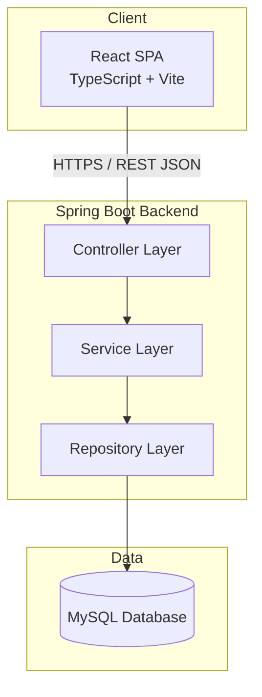

---

## 2. Frontend

- **Pattern:** Component-driven SPA with feature-based folder structure.
- **State:** Server state via React Query; local/UI state via React hooks/context.
- **Routing:** React Router with protected routes guarded by JWT presence/validity.
- **Communication:** Axios client with interceptors for attaching JWT and handling 401 refresh logic.

Full details in [`FRONTEND.md`](./FRONTEND.md).

---

## 3. Backend

- **Pattern:** Layered architecture (Controller → Service → Repository) following MVC and Repository Pattern.
- **DTO Pattern:** Entities are never exposed directly; DTOs mediate all API input/output.
- **Cross-cutting concerns:** Centralized exception handling (`@ControllerAdvice`), request validation, logging via AOP-style interceptors.

Full details in [`BACKEND.md`](./BACKEND.md).

---

## 4. Database

MySQL stores users, habits, completions, streaks, badges, and reports. See [`DATABASE.md`](./DATABASE.md) for full schema, ER diagram, and indexing strategy.

---

## 5. Authentication Flow

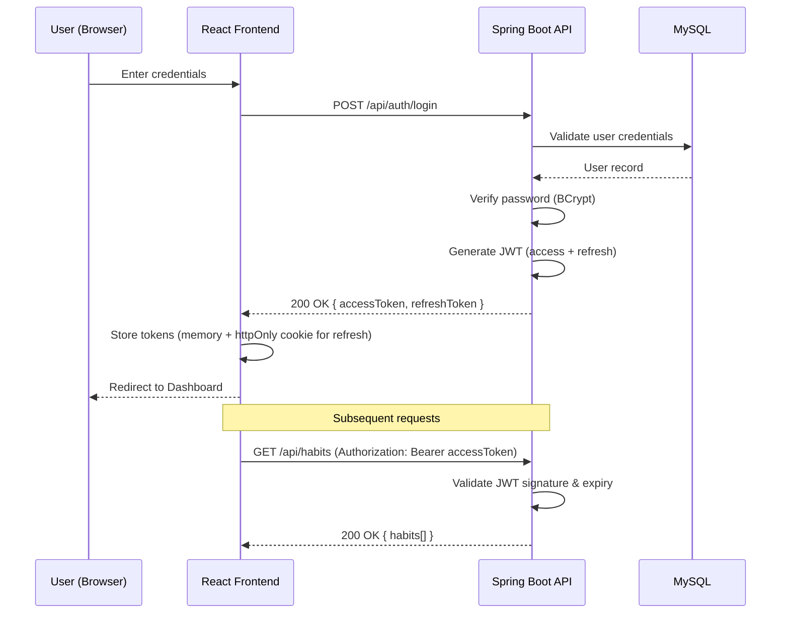

---

## 6. API Flow

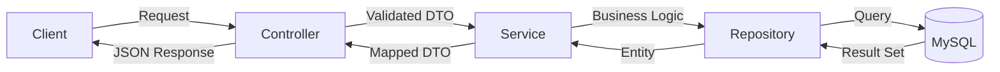

---

## 7. Sequence Diagram — Habit Completion

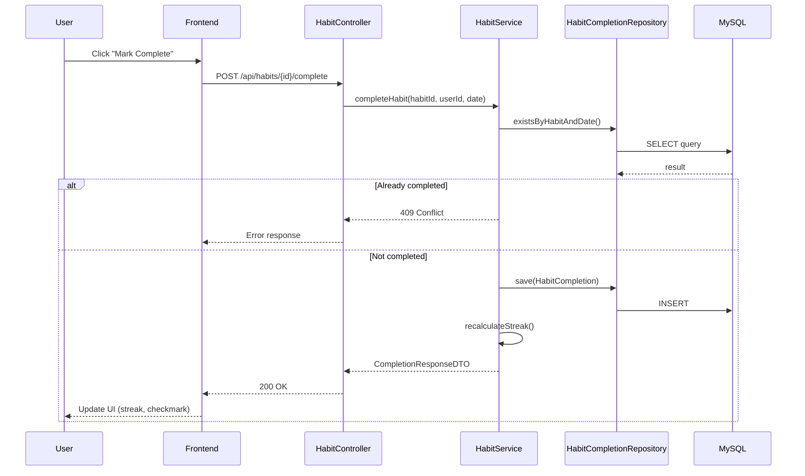

---

## 8. Component Diagram

```mermaid
graph TD
    subgraph Frontend Components
        Dashboard --> HabitList
        Dashboard --> StreakWidget
        Dashboard --> HeatmapCalendar
        Dashboard --> InsightsPanel
        HabitList --> HabitCard
        AnalyticsPage --> ChartPanel
        AnalyticsPage --> ReportExport
    end
    subgraph Backend Components
        AuthController --> AuthService
        HabitController --> HabitService
        AnalyticsController --> AnalyticsService
        InsightController --> InsightEngine
        HabitService --> HabitRepository
        AnalyticsService --> HabitCompletionRepository
        InsightEngine --> RuleSet
    end
    Frontend Components -->|REST API| Backend Components
```

---

## 9. Class Diagram (Backend Core Domain)

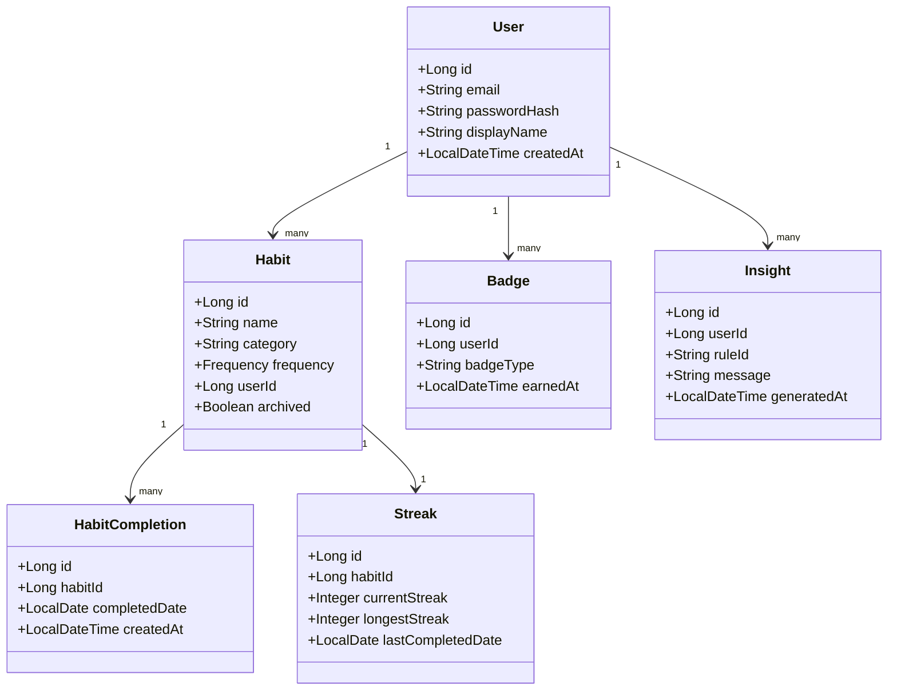

---

## 10. Folder Structure

```
backend/src/main/java/com/habitflow/
├── controller/
│   ├── AuthController.java
│   ├── HabitController.java
│   ├── AnalyticsController.java
│   ├── InsightController.java
│   └── ProfileController.java
├── service/
│   ├── AuthService.java
│   ├── HabitService.java
│   ├── AnalyticsService.java
│   └── InsightEngine.java
├── repository/
│   ├── UserRepository.java
│   ├── HabitRepository.java
│   ├── HabitCompletionRepository.java
│   └── StreakRepository.java
├── entity/
├── dto/
│   ├── request/
│   └── response/
├── security/
│   ├── JwtTokenProvider.java
│   ├── JwtAuthFilter.java
│   └── SecurityConfig.java
├── exception/
│   ├── GlobalExceptionHandler.java
│   └── custom exceptions
└── config/
```

---

## 11. Request Lifecycle

1. Client sends HTTPS request with `Authorization: Bearer <JWT>` header.
2. `JwtAuthFilter` intercepts, validates token, sets `SecurityContext`.
3. Request reaches `@RestController`, which validates the request DTO (`@Valid`).
4. Controller delegates to `Service` layer for business logic.
5. Service calls `Repository` layer (Spring Data JPA) for persistence operations.
6. Service maps entity results to response DTOs (MapStruct).
7. Controller returns JSON response with appropriate HTTP status.
8. `GlobalExceptionHandler` intercepts any thrown exceptions and returns standardized error responses.

---

## 12. Deployment Diagram

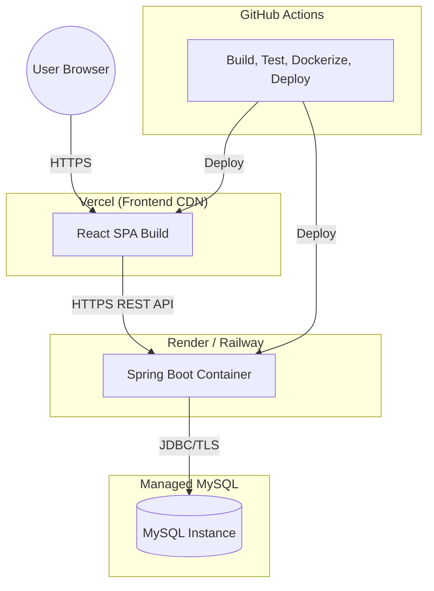

---

## 13. Data Flow

1. **Ingestion:** User actions (habit creation, completion) flow from UI → API → DB.
2. **Aggregation:** Nightly/on-demand jobs compute streaks, productivity scores, and heatmap data from raw completion records.
3. **Insight Generation:** `InsightEngine` reads aggregated analytics and evaluates rule set to produce insights.
4. **Presentation:** Frontend queries aggregated analytics endpoints (not raw data) for dashboard rendering, reducing client-side computation.

---

## 14. Scalability

- **Stateless backend:** JWT-based auth allows horizontal scaling of API instances behind a load balancer.
- **Database indexing:** Composite indexes on `(habit_id, completed_date)` for fast streak/analytics queries (see [`DATABASE.md`](./DATABASE.md)).
- **Caching:** Read-heavy analytics endpoints can be cached (e.g., Redis) with short TTLs.
- **Async processing:** Report generation and badge evaluation can be offloaded to background jobs/message queues as usage grows.
- **CDN:** Frontend static assets served via Vercel's global CDN.

Related: [`DEPLOYMENT.md`](./DEPLOYMENT.md), [`DATABASE.md`](./DATABASE.md), [`BACKEND.md`](./BACKEND.md)


<div style="page-break-after: always;"></div>

## TECH_STACK

# TECH_STACK.md

# Technology Stack — HabitFlow

This document explains every technology used in HabitFlow, why it was chosen, its advantages, and viable alternatives. See also [`DECISIONS.md`](./DECISIONS.md) for the reasoning behind major architectural trade-offs.

---

## Frontend

### React 18
- **Why:** Component-based architecture fits HabitFlow's modular UI (habit cards, charts, heatmaps). Large ecosystem and community support.
- **Advantages:** Virtual DOM performance, mature tooling, huge hiring pool, strong ecosystem (React Query, Router).
- **Alternatives:** Vue.js (simpler learning curve), Svelte (less boilerplate, smaller bundle), Angular (more opinionated, heavier).

### TypeScript
- **Why:** Type safety reduces runtime bugs, especially important for analytics data structures and API contracts.
- **Advantages:** Compile-time error catching, better IDE autocomplete, self-documenting interfaces.
- **Alternatives:** Plain JavaScript with JSDoc, Flow (largely deprecated in favor of TS).

### Vite
- **Why:** Extremely fast dev server startup and HMR compared to Webpack-based tooling.
- **Advantages:** Native ESM dev server, fast builds via esbuild/rollup, minimal config.
- **Alternatives:** Create React App (deprecated), Webpack (slower, more config), Parcel.

### Tailwind CSS
- **Why:** Utility-first CSS speeds up building consistent, responsive UI without context-switching to separate stylesheets.
- **Advantages:** Small production bundle via purge, design consistency, rapid prototyping.
- **Alternatives:** CSS Modules, styled-components, Chakra UI, plain SCSS.

### React Router
- **Why:** Standard routing solution for React SPAs; supports nested routes for dashboard/habit/analytics pages.
- **Advantages:** Declarative routing, code-splitting support, active community.
- **Alternatives:** TanStack Router, Next.js App Router (would require framework migration).

### Axios
- **Why:** Simplifies HTTP requests with interceptors for JWT attachment and centralized error handling.
- **Advantages:** Request/response interceptors, automatic JSON parsing, wide browser support.
- **Alternatives:** Native `fetch` API, ky, redaxios.

### React Query (TanStack Query)
- **Why:** Manages server state (habits, analytics) with caching, background refetching, and optimistic updates — critical for a data-heavy dashboard.
- **Advantages:** Reduces boilerplate vs. manual Redux data fetching, built-in caching/invalidation, devtools.
- **Alternatives:** SWR, Redux Toolkit Query, manual `useEffect` fetching (not recommended at scale).

### Recharts
- **Why:** Declarative, React-native charting library well-suited for productivity trends, heatmaps, and bar/line charts.
- **Advantages:** Composable chart components, responsive by default, good documentation.
- **Alternatives:** Chart.js, Nivo, Victory, D3.js (more powerful but far more complex).

---

## Backend

### Spring Boot
- **Why:** Production-grade Java framework with convention-over-configuration, ideal for building secure, maintainable REST APIs.
- **Advantages:** Auto-configuration, embedded server, huge ecosystem (Security, Data JPA, Validation), enterprise-proven.
- **Alternatives:** Node.js/Express or NestJS (JS-based, faster prototyping), Django/FastAPI (Python), Micronaut/Quarkus (lighter-weight JVM alternatives).

### Spring Security
- **Why:** Industry-standard security framework for authentication/authorization in the Spring ecosystem.
- **Advantages:** Deep JWT integration, method-level security annotations, CSRF/CORS handling built in.
- **Alternatives:** Custom auth middleware (higher risk), Shiro.

### JWT (JSON Web Tokens)
- **Why:** Stateless authentication mechanism suited for a decoupled frontend/backend architecture.
- **Advantages:** No server-side session storage, scalable across multiple backend instances, easy to verify.
- **Alternatives:** Session-based auth with server-side store (Redis), OAuth2 with an identity provider (Auth0, Keycloak) for larger scale.

### Spring Data JPA
- **Why:** Reduces boilerplate for database access via repository interfaces and derived queries.
- **Advantages:** ORM abstraction over Hibernate, pagination/sorting support, easy custom queries via JPQL.
- **Alternatives:** MyBatis (more SQL control), jOOQ (type-safe SQL), plain JDBC (more boilerplate).

### Bean Validation (Jakarta Validation)
- **Why:** Declarative request validation via annotations (`@NotNull`, `@Email`, `@Size`) on DTOs.
- **Advantages:** Centralized validation logic, integrates cleanly with Spring MVC exception handling.
- **Alternatives:** Manual validation logic in service layer.

### REST API
- **Why:** Simple, widely understood, cache-friendly, and sufficient for HabitFlow's resource-oriented domain (habits, users, reports).
- **Advantages:** Stateless, easy to document (OpenAPI), broad client compatibility.
- **Alternatives:** GraphQL (more flexible querying, added complexity), gRPC (better for internal service-to-service, not ideal for public web APIs).

---

## Database

### MySQL
- **Why:** Reliable, well-understood relational database that fits HabitFlow's structured, relationship-heavy data model (users → habits → completions).
- **Advantages:** ACID compliance, mature tooling, wide hosting support, strong indexing capabilities.
- **Alternatives:** PostgreSQL (richer feature set, JSONB support), MongoDB (flexible schema but weaker for relational analytics queries).

---

## Authentication

### JWT + Spring Security Filter Chain
- **Why:** Enables stateless, horizontally scalable authentication without server-side session storage.
- **Advantages:** Works well with SPA frontend, easy to pass in Authorization headers, supports refresh token rotation.
- **Alternatives:** Session cookies with server-side store, third-party auth providers (Auth0, Firebase Auth, Clerk).

---

## Deployment

### Docker
- **Why:** Ensures consistent environments across development, CI, and production.
- **Advantages:** Reproducible builds, easy local orchestration via Docker Compose, portable across cloud providers.
- **Alternatives:** Manual VM provisioning, Nix-based reproducible builds.

### GitHub Actions
- **Why:** Native CI/CD integration with the GitHub-hosted repository; no separate CI service needed.
- **Advantages:** YAML-based pipelines, large marketplace of reusable actions, free tier for public repos.
- **Alternatives:** GitLab CI, CircleCI, Jenkins.

### Render / Railway (Backend Hosting)
- **Why:** Simple, cost-effective PaaS options for deploying containerized Spring Boot services without managing raw infrastructure.
- **Advantages:** Git-based deploys, managed SSL, easy environment variable management.
- **Alternatives:** AWS ECS/Elastic Beanstalk, Heroku, Fly.io.

### Vercel (Frontend Hosting)
- **Why:** Purpose-built for frontend frameworks like React/Vite with global CDN and instant preview deployments.
- **Advantages:** Zero-config deploys, automatic HTTPS, edge caching, PR preview URLs.
- **Alternatives:** Netlify, Cloudflare Pages, AWS Amplify.

---

## Testing

| Layer | Tool | Purpose |
|---|---|---|
| Backend unit tests | JUnit 5 + Mockito | Service/repository logic |
| Backend integration tests | Spring Boot Test + Testcontainers | Full API + DB integration |
| Frontend unit tests | Vitest + React Testing Library | Component/hook behavior |
| API contract testing | Postman/Newman or REST Assured | Endpoint validation |
| E2E testing | Playwright or Cypress | Full user flow validation |

Full details in [`TESTING.md`](./TESTING.md).

---

## Charts & Data Visualization

- **Recharts** — primary charting library for the analytics dashboard (bar, line, radial charts).
- **Custom heatmap component** — built with CSS grid + Tailwind for the activity calendar (lighter weight than a full charting library for this specific visualization).

---

## Libraries (Notable)

| Library | Purpose |
|---|---|
| `date-fns` | Date manipulation for streaks, calendars, reports |
| `zod` | Runtime schema validation on the frontend for forms |
| `react-hook-form` | Performant form state management |
| `jjwt` (Java) | JWT creation/parsing on the backend |
| `mapstruct` | DTO ↔ Entity mapping on the backend |
| `lombok` | Boilerplate reduction (getters/setters/builders) in Java |

---

## Developer Tools

| Tool | Purpose |
|---|---|
| ESLint + Prettier | Frontend code linting/formatting |
| Checkstyle + Spotless | Backend code style enforcement |
| Husky + lint-staged | Pre-commit hooks |
| Swagger/OpenAPI (springdoc) | Auto-generated API documentation |
| Postman | Manual API testing collections |
| Docker Compose | Local multi-service orchestration |

---

Related: [`ARCHITECTURE.md`](./ARCHITECTURE.md), [`DECISIONS.md`](./DECISIONS.md), [`DEPLOYMENT.md`](./DEPLOYMENT.md)


<div style="page-break-after: always;"></div>

## FRONTEND

# FRONTEND.md

# Frontend Architecture — HabitFlow

## 1. Architecture

The frontend is a React + TypeScript SPA built with Vite, following a **feature-based folder structure** rather than a strict type-based one, to keep related components, hooks, and API calls co-located.

- **Presentation layer:** React components (functional, hooks-based)
- **State layer:** React Query for server state; React Context/hooks for local UI state
- **API layer:** Centralized Axios client with typed request/response models matching backend DTOs
- **Routing layer:** React Router with route guards for authenticated pages

---

## 2. State Management

| State Type | Tool | Example |
|---|---|---|
| Server state (habits, analytics) | React Query | `useQuery(['habits'], fetchHabits)` |
| Auth state | React Context + memory | Current user, access token |
| Form state | React Hook Form | Habit creation/edit forms |
| UI state (modals, theme) | Local `useState` / Context | Dark mode toggle, modal visibility |

React Query is chosen over global state libraries (Redux) because most application state *is* server state — caching, background refetch, and invalidation are handled declaratively rather than manually.

---

## 3. Routing

```
/                     → redirects to /dashboard or /login
/login                → LoginPage
/register             → RegisterPage
/dashboard             → Dashboard (protected)
/habits                → HabitListPage (protected)
/habits/:id             → HabitDetailPage (protected)
/analytics              → AnalyticsPage (protected)
/insights               → InsightsPage (protected)
/profile                → ProfilePage (protected)
```

Protected routes are wrapped in a `<RequireAuth>` component that checks for a valid access token and redirects to `/login` if absent/expired.

---

## 4. Folder Structure

```
frontend/src/
├── api/
│   ├── client.ts          # Axios instance + interceptors
│   ├── auth.api.ts
│   ├── habits.api.ts
│   ├── analytics.api.ts
│   └── insights.api.ts
├── components/
│   ├── ui/                # Buttons, inputs, cards (design system primitives)
│   ├── habit/              # HabitCard, HabitForm
│   ├── analytics/          # HeatmapCalendar, ProductivityScore, Charts
│   └── layout/              # Navbar, Sidebar, PageContainer
├── pages/
│   ├── LoginPage.tsx
│   ├── DashboardPage.tsx
│   ├── HabitListPage.tsx
│   ├── AnalyticsPage.tsx
│   └── InsightsPage.tsx
├── hooks/
│   ├── useAuth.ts
│   ├── useHabits.ts
│   ├── useStreak.ts
│   └── useTheme.ts
├── routes/
│   ├── AppRouter.tsx
│   └── RequireAuth.tsx
├── store/
│   └── AuthContext.tsx
├── types/
│   ├── habit.types.ts
│   └── analytics.types.ts
└── utils/
    ├── dateUtils.ts
    └── formatters.ts
```

---

## 5. Reusable Components

| Component | Purpose |
|---|---|
| `HabitCard` | Displays a single habit with completion toggle and streak badge |
| `HeatmapCalendar` | Renders daily completion heatmap grid |
| `StreakBadge` | Shows current/longest streak with flame icon |
| `ProductivityScoreGauge` | Radial gauge visualizing productivity score |
| `InsightCard` | Displays a single AI-generated insight message |
| `Modal` | Generic modal wrapper used for habit create/edit dialogs |
| `Toast` | Notification system for success/error feedback |
| `ThemeToggle` | Dark/light mode switch |

---

## 6. Hooks

| Hook | Purpose |
|---|---|
| `useAuth()` | Exposes current user, login/logout functions, token state |
| `useHabits()` | Wraps React Query for fetching/mutating habits |
| `useStreak(habitId)` | Fetches streak data for a specific habit |
| `useAnalytics(range)` | Fetches weekly/monthly analytics data |
| `useInsights()` | Fetches AI-generated insights |
| `useTheme()` | Manages and persists dark/light mode preference |
| `useDebounce(value, delay)` | Generic debounce utility for search/filter inputs |

---

## 7. UI Design

- Design system built on Tailwind CSS utility classes with a small set of shared design tokens (spacing scale, color palette, typography scale).
- Component library follows atomic-ish composition: primitives (`Button`, `Input`, `Card`) compose into feature components (`HabitCard`, `InsightCard`).
- Consistent iconography via a single icon library (e.g., Lucide React) to avoid visual inconsistency.

---

## 8. Responsive Strategy

- Mobile-first Tailwind breakpoints (`sm`, `md`, `lg`, `xl`).
- Dashboard layout collapses from multi-column (desktop) to single-column stacked cards (mobile).
- Heatmap calendar switches from full-year grid (desktop) to scrollable monthly view (mobile).
- Navigation switches from sidebar (desktop) to bottom tab bar or hamburger menu (mobile).

---

## 9. Accessibility

- Semantic HTML elements used throughout (`<button>`, `<nav>`, `<main>`, `<form>`).
- All interactive elements are keyboard-navigable with visible focus states.
- Color contrast meets WCAG AA standards in both light and dark themes.
- Charts and heatmaps include text-based summaries/alt descriptions for screen readers.
- Form inputs have associated `<label>` elements and `aria-describedby` for validation errors.

---

## 10. Performance Optimization

- Code-splitting via React Router lazy-loaded routes (`React.lazy` + `Suspense`).
- React Query caching reduces redundant network requests across navigations.
- Memoization (`useMemo`, `React.memo`) applied to expensive chart computations.
- Images and icons optimized/served in modern formats (SVG/WebP).
- Vite's production build performs tree-shaking and code minification automatically.
- Virtualization considered for long habit lists (e.g., `react-window`) at scale.

Related: [`ARCHITECTURE.md`](./ARCHITECTURE.md), [`TECH_STACK.md`](./TECH_STACK.md), [`CODING_STANDARDS.md`](./CODING_STANDARDS.md)


<div style="page-break-after: always;"></div>

## BACKEND

# BACKEND.md

# Backend Architecture — HabitFlow

## 1. Package Structure

```
com.habitflow/
├── controller/       # REST endpoints (thin, delegate to services)
├── service/          # Business logic
├── repository/       # Spring Data JPA interfaces
├── entity/           # JPA entities (persistence model)
├── dto/
│   ├── request/       # Incoming request payloads
│   └── response/      # Outgoing response payloads
├── mapper/            # MapStruct entity <-> DTO mappers
├── security/          # JWT filter, security config
├── exception/         # Custom exceptions + global handler
└── config/            # Beans, CORS, OpenAPI config
```

This structure enforces the **Layered Architecture** and **Repository Pattern** described in [`ARCHITECTURE.md`](./ARCHITECTURE.md): each layer only depends on the layer directly beneath it.

---

## 2. Controllers

- Annotated with `@RestController`, mapped under `/api/**`.
- Responsible only for: request routing, input validation triggering (`@Valid`), and delegating to services.
- No business logic lives in controllers.

```java
@RestController
@RequestMapping("/api/habits")
@RequiredArgsConstructor
public class HabitController {

    private final HabitService habitService;

    @PostMapping
    public ResponseEntity<HabitResponseDTO> createHabit(
            @Valid @RequestBody HabitRequestDTO request,
            @AuthenticationPrincipal UserPrincipal user) {
        HabitResponseDTO created = habitService.createHabit(request, user.getId());
        return ResponseEntity.status(HttpStatus.CREATED).body(created);
    }
}
```

---

## 3. Services

- Contain all business logic: streak calculation, productivity score computation, insight generation orchestration.
- Annotated with `@Service`, transactional boundaries defined with `@Transactional`.
- Services depend on repositories and mappers, never directly on the HTTP layer.

```java
@Service
@RequiredArgsConstructor
public class HabitService {

    private final HabitRepository habitRepository;
    private final HabitCompletionRepository completionRepository;
    private final StreakRepository streakRepository;
    private final HabitMapper habitMapper;

    @Transactional
    public CompletionResponseDTO completeHabit(Long habitId, Long userId, LocalDate date) {
        Habit habit = habitRepository.findByIdAndUserId(habitId, userId)
            .orElseThrow(() -> new ResourceNotFoundException("Habit not found"));

        if (completionRepository.existsByHabitIdAndCompletedDate(habitId, date)) {
            throw new ConflictException("Habit already completed for this date");
        }

        completionRepository.save(new HabitCompletion(habitId, date));
        Streak streak = recalculateStreak(habit, date);
        return habitMapper.toCompletionResponse(habit, streak);
    }
}
```

---

## 4. Repositories

- Spring Data JPA interfaces extending `JpaRepository<Entity, Long>`.
- Custom derived queries used where possible; `@Query` (JPQL) for more complex analytics queries.

```java
public interface HabitCompletionRepository extends JpaRepository<HabitCompletion, Long> {
    boolean existsByHabitIdAndCompletedDate(Long habitId, LocalDate date);

    @Query("SELECT COUNT(c) FROM HabitCompletion c WHERE c.habitId = :habitId " +
           "AND c.completedDate BETWEEN :start AND :end")
    long countCompletionsInRange(Long habitId, LocalDate start, LocalDate end);
}
```

---

## 5. DTOs

- **Request DTOs** validate and shape incoming data (`HabitRequestDTO`, `LoginRequestDTO`).
- **Response DTOs** control exactly what's exposed to clients, decoupling API contracts from the persistence model.
- Mapping handled via MapStruct to avoid manual boilerplate and reduce mapping bugs.

```java
public record HabitRequestDTO(
    @NotBlank @Size(max = 150) String name,
    Long categoryId,
    @NotNull Frequency frequency,
    @Min(1) @Max(7) Integer targetPerWeek
) {}
```

---

## 6. Entities

- Annotated JPA entities mapped 1:1 to database tables described in [`DATABASE.md`](./DATABASE.md).
- Use Lombok (`@Getter`, `@Builder`) to reduce boilerplate while keeping entities free of business logic.

```java
@Entity
@Table(name = "habits")
@Getter @Setter @Builder
@NoArgsConstructor @AllArgsConstructor
public class Habit {
    @Id @GeneratedValue(strategy = GenerationType.IDENTITY)
    private Long id;

    @Column(nullable = false)
    private String name;

    @Enumerated(EnumType.STRING)
    private Frequency frequency;

    private Boolean archived;

    @Column(name = "user_id", nullable = false)
    private Long userId;
}
```

---

## 7. Exception Handling

Centralized via `@ControllerAdvice`, translating exceptions into standardized error responses (see [`API.md`](./API.md) for the error schema).

```java
@RestControllerAdvice
public class GlobalExceptionHandler {

    @ExceptionHandler(ResourceNotFoundException.class)
    public ResponseEntity<ErrorResponse> handleNotFound(ResourceNotFoundException ex) {
        return buildResponse(HttpStatus.NOT_FOUND, ex.getMessage());
    }

    @ExceptionHandler(ConflictException.class)
    public ResponseEntity<ErrorResponse> handleConflict(ConflictException ex) {
        return buildResponse(HttpStatus.CONFLICT, ex.getMessage());
    }

    @ExceptionHandler(MethodArgumentNotValidException.class)
    public ResponseEntity<ErrorResponse> handleValidation(MethodArgumentNotValidException ex) {
        String message = ex.getBindingResult().getFieldErrors().stream()
            .map(e -> e.getField() + ": " + e.getDefaultMessage())
            .collect(Collectors.joining(", "));
        return buildResponse(HttpStatus.BAD_REQUEST, message);
    }
}
```

Custom exceptions: `ResourceNotFoundException`, `ConflictException`, `UnauthorizedException`, `ValidationException`.

---

## 8. Validation

- Jakarta Bean Validation annotations on request DTOs (`@NotBlank`, `@Email`, `@Size`, `@Min/@Max`).
- Cross-field validation (e.g., `targetPerWeek` required only when `frequency == WEEKLY`) implemented via custom `@AssertTrue` methods or a custom validator annotation.
- Validation errors return `400 Bad Request` with field-level messages via `GlobalExceptionHandler`.

---

## 9. Logging

- SLF4J + Logback for structured logging.
- Each request tagged with a correlation ID (`MDC`) for traceability across logs.
- Log levels: `ERROR` for exceptions, `WARN` for auth failures/validation issues, `INFO` for key business events (habit created, streak milestone), `DEBUG` for detailed tracing in non-production environments.
- Sensitive fields (passwords, tokens) are excluded from all log statements.

---

## 10. Caching

- Spring Cache abstraction (`@Cacheable`) applied to read-heavy, infrequently-changing analytics queries (e.g., productivity score for the current day).
- Redis recommended as the caching provider for multi-instance deployments (in-memory `ConcurrentMapCacheManager` sufficient for single-instance/dev).
- Cache eviction triggered on relevant writes (e.g., new completion invalidates that user's productivity score cache).

---

## 11. Configuration

- Environment-specific configuration via Spring Profiles (`application-local.yml`, `application-prod.yml`).
- Sensitive values (DB credentials, JWT secret) injected via environment variables, never hardcoded.
- `SecurityConfig` defines the JWT filter chain, CORS policy, and public/protected endpoint matchers.
- `OpenApiConfig` (springdoc-openapi) auto-generates Swagger UI at `/swagger-ui.html` for API exploration in non-production environments.

Related: [`ARCHITECTURE.md`](./ARCHITECTURE.md), [`API.md`](./API.md), [`DATABASE.md`](./DATABASE.md), [`CODING_STANDARDS.md`](./CODING_STANDARDS.md)


<div style="page-break-after: always;"></div>

## DATABASE

# DATABASE.md

# Database Design — HabitFlow

## 1. ER Diagram

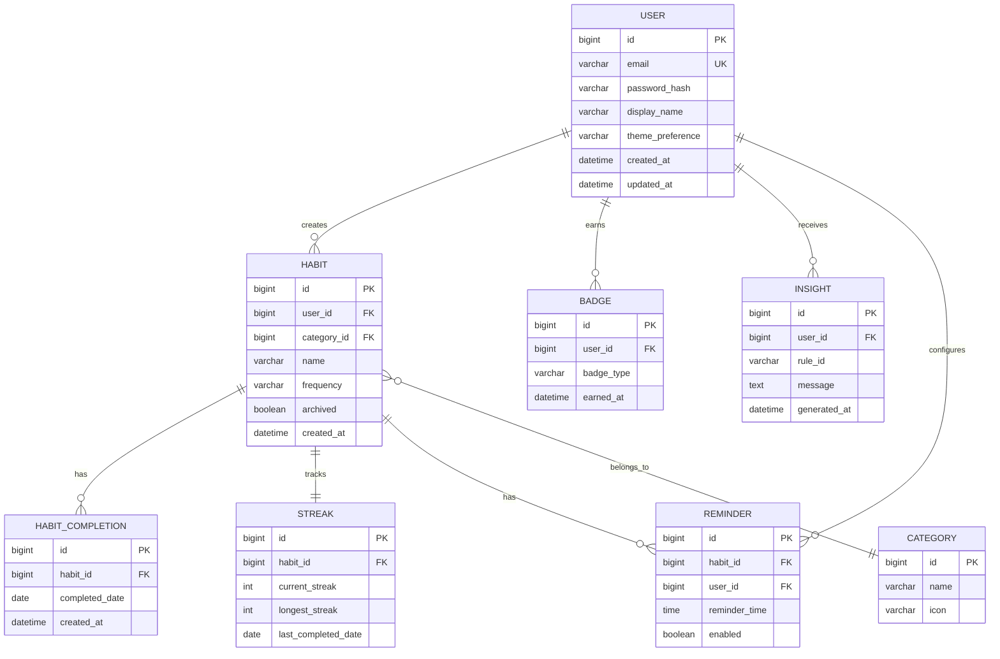

---

## 2. Tables

### `users`
| Column | Type | Constraints |
|---|---|---|
| id | BIGINT | PK, AUTO_INCREMENT |
| email | VARCHAR(255) | UNIQUE, NOT NULL |
| password_hash | VARCHAR(255) | NOT NULL |
| display_name | VARCHAR(100) | NOT NULL |
| theme_preference | ENUM('LIGHT','DARK') | DEFAULT 'LIGHT' |
| created_at | DATETIME | NOT NULL, DEFAULT CURRENT_TIMESTAMP |
| updated_at | DATETIME | ON UPDATE CURRENT_TIMESTAMP |

### `categories`
| Column | Type | Constraints |
|---|---|---|
| id | BIGINT | PK, AUTO_INCREMENT |
| name | VARCHAR(50) | UNIQUE, NOT NULL |
| icon | VARCHAR(50) | NULLABLE |

### `habits`
| Column | Type | Constraints |
|---|---|---|
| id | BIGINT | PK, AUTO_INCREMENT |
| user_id | BIGINT | FK → users.id, NOT NULL |
| category_id | BIGINT | FK → categories.id, NULLABLE |
| name | VARCHAR(150) | NOT NULL |
| frequency | ENUM('DAILY','WEEKLY') | NOT NULL |
| target_per_week | TINYINT | NULLABLE (for weekly habits) |
| archived | BOOLEAN | DEFAULT FALSE |
| created_at | DATETIME | NOT NULL, DEFAULT CURRENT_TIMESTAMP |

### `habit_completions`
| Column | Type | Constraints |
|---|---|---|
| id | BIGINT | PK, AUTO_INCREMENT |
| habit_id | BIGINT | FK → habits.id, NOT NULL |
| completed_date | DATE | NOT NULL |
| created_at | DATETIME | NOT NULL, DEFAULT CURRENT_TIMESTAMP |
| — | — | UNIQUE(habit_id, completed_date) |

### `streaks`
| Column | Type | Constraints |
|---|---|---|
| id | BIGINT | PK, AUTO_INCREMENT |
| habit_id | BIGINT | FK → habits.id, UNIQUE, NOT NULL |
| current_streak | INT | DEFAULT 0 |
| longest_streak | INT | DEFAULT 0 |
| last_completed_date | DATE | NULLABLE |

### `badges`
| Column | Type | Constraints |
|---|---|---|
| id | BIGINT | PK, AUTO_INCREMENT |
| user_id | BIGINT | FK → users.id, NOT NULL |
| badge_type | VARCHAR(50) | NOT NULL |
| earned_at | DATETIME | NOT NULL, DEFAULT CURRENT_TIMESTAMP |
| — | — | UNIQUE(user_id, badge_type) |

### `insights`
| Column | Type | Constraints |
|---|---|---|
| id | BIGINT | PK, AUTO_INCREMENT |
| user_id | BIGINT | FK → users.id, NOT NULL |
| rule_id | VARCHAR(50) | NOT NULL |
| message | TEXT | NOT NULL |
| generated_at | DATETIME | NOT NULL, DEFAULT CURRENT_TIMESTAMP |

### `reminders`
| Column | Type | Constraints |
|---|---|---|
| id | BIGINT | PK, AUTO_INCREMENT |
| habit_id | BIGINT | FK → habits.id, NOT NULL |
| user_id | BIGINT | FK → users.id, NOT NULL |
| reminder_time | TIME | NOT NULL |
| enabled | BOOLEAN | DEFAULT TRUE |

---

## 3. Relationships

- `users 1—N habits`: a user owns many habits.
- `habits 1—N habit_completions`: each habit has many daily completion records.
- `habits 1—1 streaks`: each habit maintains exactly one streak record (updated incrementally).
- `users 1—N badges`: a user can earn many distinct badge types.
- `users 1—N insights`: generated insights are stored per user for history/audit.
- `habits N—1 categories`: many habits can belong to one category.
- `habits 1—N reminders`: a habit can have multiple reminder times configured.

---

## 4. Indexes

| Table | Index | Purpose |
|---|---|---|
| `habit_completions` | `idx_habit_date (habit_id, completed_date)` | Fast streak/analytics range queries |
| `habits` | `idx_user_id (user_id)` | Fast retrieval of a user's habits |
| `habits` | `idx_user_archived (user_id, archived)` | Filter active habits efficiently |
| `users` | `idx_email (email)` UNIQUE | Fast login lookup, enforce uniqueness |
| `insights` | `idx_user_generated (user_id, generated_at)` | Fetch latest insights per user |
| `badges` | `idx_user_badge (user_id, badge_type)` UNIQUE | Prevent duplicate badge awards |

---

## 5. Constraints

- `habit_completions(habit_id, completed_date)` — UNIQUE, prevents duplicate completion entries for the same day.
- `badges(user_id, badge_type)` — UNIQUE, prevents duplicate badge awards.
- Foreign keys use `ON DELETE CASCADE` for `habit_completions`, `streaks`, and `reminders` when a parent habit is deleted.
- `users.email` — UNIQUE and NOT NULL.
- `habits.frequency` — CHECK constraint restricting values to `DAILY` or `WEEKLY`.

---

## 6. Normalization

The schema is normalized to **Third Normal Form (3NF)**:
- All non-key attributes depend only on the primary key (no partial dependencies since all PKs are single-column surrogate keys).
- No transitive dependencies — e.g., `category name` is stored only in `categories`, referenced via `category_id` in `habits`, not duplicated.
- Derived/aggregate data (streaks, productivity scores) is intentionally denormalized into dedicated tables (`streaks`) for performance, recalculated via application logic rather than computed on every read — a deliberate trade-off documented in [`DECISIONS.md`](./DECISIONS.md).

---

## 7. Sample Data

```sql
INSERT INTO users (id, email, password_hash, display_name) VALUES
(1, 'sam@example.com', '$2a$12$hashedpassword...', 'Structured Sam');

INSERT INTO categories (id, name, icon) VALUES
(1, 'Fitness', 'dumbbell'), (2, 'Learning', 'book'), (3, 'Mindfulness', 'leaf');

INSERT INTO habits (id, user_id, category_id, name, frequency, archived) VALUES
(1, 1, 1, 'Morning Run', 'DAILY', false),
(2, 1, 2, 'Read 20 Pages', 'DAILY', false);

INSERT INTO habit_completions (habit_id, completed_date) VALUES
(1, '2026-07-20'), (1, '2026-07-21'), (1, '2026-07-22');

INSERT INTO streaks (habit_id, current_streak, longest_streak, last_completed_date) VALUES
(1, 3, 5, '2026-07-22');
```

---

## 8. Future Tables

| Table | Purpose |
|---|---|
| `teams` | Support group/organization habit tracking |
| `team_members` | Map users to teams with roles |
| `challenges` | Social accountability challenges between users |
| `ml_feature_snapshots` | Store precomputed features for future ML-based insights |
| `audit_logs` | Track sensitive account/security events |
| `notification_log` | History of sent reminders/push notifications |

Related: [`ARCHITECTURE.md`](./ARCHITECTURE.md), [`ANALYTICS.md`](./ANALYTICS.md), [`BACKEND.md`](./BACKEND.md)


<div style="page-break-after: always;"></div>

## API

# API.md

# API Documentation — HabitFlow

**Base URL:** `https://api-habitflow.onrender.com/api`
**Content-Type:** `application/json`
**Auth Header:** `Authorization: Bearer <accessToken>` (required for all endpoints except `/auth/register` and `/auth/login`)

---

## Standard Error Response Format

```json
{
  "timestamp": "2026-07-23T10:15:30Z",
  "status": 400,
  "error": "Bad Request",
  "message": "Validation failed for field 'email'",
  "path": "/api/auth/register"
}
```

---

## 1. Authentication

### `POST /auth/register`
Registers a new user.

**Request:**
```json
{
  "email": "sam@example.com",
  "password": "SecurePass123!",
  "displayName": "Structured Sam"
}
```

**Response `201 Created`:**
```json
{
  "id": 1,
  "email": "sam@example.com",
  "displayName": "Structured Sam",
  "createdAt": "2026-07-23T10:00:00Z"
}
```

**Status Codes:** `201 Created`, `400 Bad Request` (validation), `409 Conflict` (email exists)

**Error Example (409):**
```json
{ "status": 409, "error": "Conflict", "message": "Email already registered" }
```

---

### `POST /auth/login`
Authenticates a user and returns tokens.

**Request:**
```json
{ "email": "sam@example.com", "password": "SecurePass123!" }
```

**Response `200 OK`:**
```json
{
  "accessToken": "eyJhbGciOi...",
  "refreshToken": "eyJhbGciOi...",
  "expiresIn": 3600
}
```

**Status Codes:** `200 OK`, `401 Unauthorized` (invalid credentials)

---

### `POST /auth/refresh`
Issues a new access token using a valid refresh token.

**Request:**
```json
{ "refreshToken": "eyJhbGciOi..." }
```

**Response `200 OK`:**
```json
{ "accessToken": "eyJhbGciOi...", "expiresIn": 3600 }
```

**Status Codes:** `200 OK`, `401 Unauthorized` (expired/invalid refresh token)

---

### `POST /auth/logout`
Invalidates the current refresh token.

**Response:** `204 No Content`

---

## 2. Habits

### `GET /habits`
Returns all habits for the authenticated user.

**Query Params:** `?archived=false&category=Fitness`

**Response `200 OK`:**
```json
[
  {
    "id": 1,
    "name": "Morning Run",
    "category": "Fitness",
    "frequency": "DAILY",
    "archived": false,
    "currentStreak": 3,
    "longestStreak": 5
  }
]
```

---

### `POST /habits`
Creates a new habit.

**Request:**
```json
{
  "name": "Morning Run",
  "categoryId": 1,
  "frequency": "DAILY",
  "targetPerWeek": null
}
```

**Response `201 Created`:**
```json
{ "id": 1, "name": "Morning Run", "category": "Fitness", "frequency": "DAILY", "archived": false }
```

**Status Codes:** `201 Created`, `400 Bad Request`

---

### `PUT /habits/{id}`
Updates an existing habit.

**Request:**
```json
{ "name": "Evening Run", "frequency": "DAILY" }
```

**Response `200 OK`:** Updated habit object.

**Status Codes:** `200 OK`, `404 Not Found`, `403 Forbidden` (not owner)

---

### `DELETE /habits/{id}`
Deletes (or archives) a habit.

**Response:** `204 No Content`
**Status Codes:** `204 No Content`, `404 Not Found`

---

### `POST /habits/{id}/complete`
Marks a habit complete for a given date (defaults to today).

**Request:**
```json
{ "date": "2026-07-23" }
```

**Response `200 OK`:**
```json
{
  "habitId": 1,
  "completedDate": "2026-07-23",
  "currentStreak": 4,
  "longestStreak": 5
}
```

**Status Codes:** `200 OK`, `409 Conflict` (already completed), `404 Not Found`

**Error Example (409):**
```json
{ "status": 409, "error": "Conflict", "message": "Habit already completed for this date" }
```

---

### `DELETE /habits/{id}/complete`
Un-marks a completion for a given date (undo action).

**Request:**
```json
{ "date": "2026-07-23" }
```

**Response:** `204 No Content`

---

## 3. Analytics

### `GET /analytics/heatmap`
Returns completion data formatted for the heatmap calendar.

**Query Params:** `?year=2026&month=7`

**Response `200 OK`:**
```json
{
  "year": 2026,
  "month": 7,
  "days": [
    { "date": "2026-07-01", "completionRate": 1.0 },
    { "date": "2026-07-02", "completionRate": 0.5 }
  ]
}
```

---

### `GET /analytics/productivity-score`
Returns the user's current productivity score.

**Response `200 OK`:**
```json
{ "score": 78, "trend": "up", "comparedToLastWeek": 6 }
```

See [`ANALYTICS.md`](./ANALYTICS.md) for the scoring algorithm.

---

## 4. Reports

### `GET /reports/weekly`
Returns the weekly analytics report.

**Query Params:** `?weekStart=2026-07-14`

**Response `200 OK`:**
```json
{
  "weekStart": "2026-07-14",
  "weekEnd": "2026-07-20",
  "totalCompletions": 18,
  "totalPossible": 21,
  "completionRate": 0.857,
  "habitsBreakdown": [
    { "habitId": 1, "name": "Morning Run", "completions": 6, "possible": 7 }
  ]
}
```

---

### `GET /reports/monthly`
Returns the monthly analytics report. Same structure as weekly, scoped to a month.

**Status Codes (all report endpoints):** `200 OK`, `404 Not Found` (no data for range)

---

### `GET /reports/export`
Exports a report as PDF or CSV.

**Query Params:** `?type=monthly&format=pdf&month=2026-07`

**Response:** Binary file stream (`Content-Type: application/pdf` or `text/csv`)

**Status Codes:** `200 OK`, `400 Bad Request` (invalid format)

---

## 5. Insights

### `GET /insights`
Returns current rule-based AI insights for the user.

**Response `200 OK`:**
```json
[
  {
    "ruleId": "STREAK_RISK",
    "message": "Your 'Morning Run' streak may break — you haven't logged it in 2 days.",
    "generatedAt": "2026-07-23T08:00:00Z"
  },
  {
    "ruleId": "BEST_TIME",
    "message": "You complete 'Read 20 Pages' most consistently in the evenings.",
    "generatedAt": "2026-07-23T08:00:00Z"
  }
]
```

**Status Codes:** `200 OK` (empty array if insufficient data)

See [`AI_INSIGHTS.md`](./AI_INSIGHTS.md) for the rule engine.

---

## 6. Profile

### `GET /profile`
Returns the authenticated user's profile.

**Response `200 OK`:**
```json
{
  "id": 1,
  "email": "sam@example.com",
  "displayName": "Structured Sam",
  "themePreference": "DARK",
  "badgeCount": 4
}
```

---

### `PUT /profile`
Updates profile fields.

**Request:**
```json
{ "displayName": "Sam R.", "themePreference": "DARK" }
```

**Response `200 OK`:** Updated profile object.

---

### `PUT /profile/password`
Changes the user's password.

**Request:**
```json
{ "currentPassword": "OldPass123!", "newPassword": "NewPass456!" }
```

**Response:** `204 No Content`
**Status Codes:** `204 No Content`, `401 Unauthorized` (wrong current password)

---

## Global Error Responses

| Status | Meaning | Example Scenario |
|---|---|---|
| 400 | Bad Request | Validation failure on request body |
| 401 | Unauthorized | Missing/invalid/expired JWT |
| 403 | Forbidden | User doesn't own the resource |
| 404 | Not Found | Resource ID doesn't exist |
| 409 | Conflict | Duplicate resource (e.g., email, completion) |
| 429 | Too Many Requests | Rate limit exceeded (see [`SECURITY.md`](./SECURITY.md)) |
| 500 | Internal Server Error | Unhandled exception |

Related: [`SECURITY.md`](./SECURITY.md), [`BACKEND.md`](./BACKEND.md), [`ANALYTICS.md`](./ANALYTICS.md)


<div style="page-break-after: always;"></div>

## SECURITY

# SECURITY.md

# Security — HabitFlow

## 1. Threat Model

| Asset | Threats | Mitigation |
|---|---|---|
| User credentials | Brute force, credential stuffing | Rate limiting, BCrypt hashing, account lockout |
| JWT tokens | Theft via XSS, replay attacks | Short-lived access tokens, httpOnly refresh cookie, token rotation |
| User habit data | Unauthorized access (IDOR) | Ownership checks on every resource access |
| Database | SQL injection | Parameterized queries via JPA/Hibernate |
| API endpoints | DoS, abuse | Rate limiting, request size limits |
| Personal data | Data breach | Encryption at rest/in transit, least-privilege DB access |

---

## 2. Authentication

- Email/password authentication with credentials verified against a BCrypt hash.
- Successful login issues a short-lived **access token** (JWT) and a longer-lived **refresh token**.
- Failed login attempts are rate-limited per IP and per account to mitigate brute-force attacks.

---

## 3. Authorization

- All habit/analytics/report resources are scoped to the authenticated user (`user_id` extracted from JWT claims, never trusted from client input).
- Method-level authorization enforced via Spring Security (`@PreAuthorize("#userId == authentication.principal.id")`).
- Ownership checks performed in the service layer before any read/write/delete operation to prevent Insecure Direct Object Reference (IDOR).

---

## 4. JWT Strategy

- **Access Token:** short-lived (15–60 minutes), sent in `Authorization: Bearer` header, stored in memory (not localStorage, to reduce XSS exposure).
- **Refresh Token:** longer-lived (7–30 days), stored in an `httpOnly`, `Secure`, `SameSite=Strict` cookie.
- Tokens are signed using HMAC-SHA256 (HS256) with a secret managed via environment variables, or RS256 with rotating key pairs for larger deployments.
- Refresh tokens are rotated on each use (old token invalidated) to limit replay attack windows.
- Token claims include `sub` (user ID), `iat`, `exp`, and a `jti` (unique token ID) for revocation support.

---

## 5. Password Hashing

- Passwords hashed with **BCrypt**, cost factor ≥ 12.
- Plaintext passwords are never logged, stored, or transmitted outside the initial HTTPS request.
- Password change/reset flows require re-authentication or a time-limited, single-use reset token.

---

## 6. CSRF

- Since HabitFlow uses stateless JWT auth (Bearer token in header, not cookies for primary auth), CSRF risk is minimal for the API itself.
- The refresh-token cookie is protected via `SameSite=Strict` and `httpOnly` flags to prevent cross-site submission.
- Spring Security's CSRF protection is explicitly disabled only for stateless JWT-authenticated endpoints, and retained for any cookie-based session use if introduced later.

---

## 7. CORS

- CORS is configured to allow only the known frontend origin(s) (e.g., `https://habitflow.vercel.app`, `http://localhost:5173` in development).
- Only required methods (`GET, POST, PUT, DELETE`) and headers (`Authorization, Content-Type`) are permitted.
- Wildcard (`*`) origins are never used in production.

---

## 8. SQL Injection Prevention

- All database access goes through Spring Data JPA / Hibernate, which uses parameterized queries by default.
- No raw string concatenation is used to build SQL/JPQL queries.
- Any native queries (if required) use named parameters (`:paramName`) rather than string interpolation.

---

## 9. XSS Prevention

- React escapes all rendered content by default, preventing injection via the DOM.
- `dangerouslySetInnerHTML` is avoided; any rich text rendering uses a sanitization library (e.g., DOMPurify) if ever required.
- API responses set `Content-Type: application/json` strictly, preventing content-type sniffing exploits.
- Content Security Policy (CSP) headers are configured to restrict script sources.

---

## 10. Rate Limiting

- Login and registration endpoints are rate-limited (e.g., 5 attempts per minute per IP) using a token-bucket algorithm (Bucket4j or API gateway-level limiting).
- General API endpoints are limited per authenticated user (e.g., 100 requests/minute) to prevent abuse.
- Exceeding limits returns `429 Too Many Requests` with a `Retry-After` header.

---

## 11. Secrets Management

- Secrets (DB credentials, JWT signing keys, third-party API keys) are never committed to source control.
- Local development uses `.env` files (git-ignored); production uses the hosting platform's environment variable/secret manager (Render/Railway secrets, GitHub Actions encrypted secrets).
- JWT signing keys are rotated periodically; old keys retained briefly for token validation during rotation windows.

---

## 12. Logging

- Application logs exclude sensitive data: no passwords, raw JWTs, or full credit card/PII data in logs.
- Structured logging (JSON format) with correlation IDs per request for traceability.
- Authentication failures, authorization denials, and unusual access patterns are logged for audit purposes.

---

## 13. Monitoring

- Health check endpoint (`/actuator/health`) exposed for uptime monitoring.
- Error rate and latency monitored via APM tooling (e.g., Prometheus + Grafana, or hosted alternatives).
- Alerting configured for spikes in `401/403/429` responses, which may indicate an attack in progress.

---

## 14. OWASP Top 10 Mitigation Summary

| OWASP Risk | Mitigation |
|---|---|
| A01: Broken Access Control | Ownership checks, method-level `@PreAuthorize` |
| A02: Cryptographic Failures | BCrypt hashing, HTTPS enforced, secrets in env vars |
| A03: Injection | Parameterized JPA queries, input validation |
| A04: Insecure Design | Threat modeling during design phase, layered architecture |
| A05: Security Misconfiguration | Hardened Spring Security config, no default credentials |
| A06: Vulnerable Components | Automated dependency scanning (Dependabot/Snyk) |
| A07: Auth Failures | JWT expiry, rate limiting, account lockout |
| A08: Data Integrity Failures | Signed JWTs, CI/CD pipeline integrity checks |
| A09: Logging & Monitoring Failures | Structured logs, alerting on anomalies |
| A10: SSRF | No user-controlled outbound requests in current scope |

---

## 15. Security Checklist

- [ ] All endpoints require authentication except `/auth/register`, `/auth/login`, `/auth/refresh`
- [ ] Passwords hashed with BCrypt (cost ≥ 12)
- [ ] JWT access tokens expire within 60 minutes
- [ ] Refresh tokens stored in httpOnly, Secure cookies
- [ ] CORS restricted to known origins
- [ ] Rate limiting active on auth endpoints
- [ ] Dependency scanning enabled in CI
- [ ] HTTPS enforced (HSTS header set)
- [ ] No secrets committed to version control
- [ ] Input validation on all DTOs
- [ ] Ownership checks on all resource access
- [ ] Security headers set (CSP, X-Content-Type-Options, X-Frame-Options)

Related: [`API.md`](./API.md), [`BACKEND.md`](./BACKEND.md), [`DEPLOYMENT.md`](./DEPLOYMENT.md)


<div style="page-break-after: always;"></div>

## TESTING

# TESTING.md

# Testing Strategy — HabitFlow

## 1. Unit Testing

**Backend (JUnit 5 + Mockito):**
- Services tested in isolation with mocked repositories.
- Focus: streak calculation logic, productivity score formula, validation edge cases.

```java
@Test
void shouldIncrementStreak_whenCompletedOnConsecutiveDay() {
    Habit habit = Habit.builder().id(1L).build();
    Streak existing = new Streak(1L, 5, 5, LocalDate.of(2026,7,22));
    when(streakRepository.findByHabitId(1L)).thenReturn(Optional.of(existing));

    Streak result = habitService.recalculateStreak(habit, LocalDate.of(2026,7,23));

    assertEquals(6, result.getCurrentStreak());
}
```

**Frontend (Vitest + React Testing Library):**
- Component rendering, hook logic, form validation.

```ts
test('HabitCard shows current streak', () => {
  render(<HabitCard habit={{ name: 'Run', currentStreak: 4 }} />);
  expect(screen.getByText(/4 day streak/i)).toBeInTheDocument();
});
```

---

## 2. Integration Testing

- Spring Boot Test with **Testcontainers** spinning up a real MySQL instance to validate repository queries and full request-to-database flows.
- Verifies JPA mappings, constraint enforcement (unique completion per day), and transactional rollback behavior.

```java
@SpringBootTest
@Testcontainers
class HabitCompletionIntegrationTest {
    @Container
    static MySQLContainer<?> mysql = new MySQLContainer<>("mysql:8.0");

    @Test
    void shouldRejectDuplicateCompletionForSameDay() {
        // save first completion, assert second throws DataIntegrityViolationException
    }
}
```

---

## 3. Frontend Testing

| Type | Tool | Scope |
|---|---|---|
| Component tests | React Testing Library | Rendering, user interaction (click, form submit) |
| Hook tests | Vitest + `renderHook` | `useAuth`, `useHabits`, `useStreak` logic |
| Snapshot tests | Vitest snapshots | Stable UI components (charts, cards) — used sparingly |
| Accessibility tests | `jest-axe` (via Vitest) | Automated a11y checks on key pages |

---

## 4. Backend Testing

| Type | Tool | Scope |
|---|---|---|
| Unit tests | JUnit 5 + Mockito | Service layer business logic |
| Repository tests | `@DataJpaTest` + H2/Testcontainers | Query correctness |
| Security tests | Spring Security Test | JWT filter behavior, access control |
| Contract tests | Spring REST Docs / OpenAPI validation | Ensure API matches documented contract |

---

## 5. API Testing

- Postman collection covering all endpoints in [`API.md`](./API.md), run via `newman` in CI.
- Assertions on status codes, response schema, and error message formats.
- Includes negative test cases: missing auth header, invalid payloads, duplicate resource creation.

---

## 6. Performance Testing

- **Load testing** with k6 or JMeter against staging environment.
- Target: 95th percentile response time < 300ms under 500 concurrent virtual users (aligned with NFR-01/NFR-02 in [`PRD.md`](./PRD.md)).
- Key endpoints tested: `GET /habits`, `POST /habits/{id}/complete`, `GET /analytics/heatmap`.
- Database query performance validated via `EXPLAIN ANALYZE` on analytics queries against realistic data volumes (100k+ completion rows).

---

## 7. Security Testing

- Automated dependency vulnerability scanning (Dependabot/Snyk) in CI.
- OWASP ZAP baseline scan against staging API for common vulnerabilities.
- Manual test cases: JWT tampering, expired token handling, IDOR attempts (accessing another user's habit by ID), SQL injection payloads in query params.
- See [`SECURITY.md`](./SECURITY.md) for the full checklist these tests validate against.

---

## 8. Test Cases (Representative Sample)

| ID | Scenario | Expected Result |
|---|---|---|
| TC-01 | Register with valid data | 201 Created, user persisted |
| TC-02 | Register with existing email | 409 Conflict |
| TC-03 | Login with correct credentials | 200 OK, tokens returned |
| TC-04 | Login with wrong password | 401 Unauthorized |
| TC-05 | Create habit while authenticated | 201 Created |
| TC-06 | Create habit without auth token | 401 Unauthorized |
| TC-07 | Complete habit twice same day | Second call returns 409 Conflict |
| TC-08 | Complete habit on consecutive day | currentStreak increments by 1 |
| TC-09 | Miss a day then complete | currentStreak resets to 1 |
| TC-10 | Access another user's habit by ID | 403 Forbidden or 404 Not Found |
| TC-11 | Fetch insights with < 7 days data | Empty array returned, no error |
| TC-12 | Export monthly report as PDF | 200 OK, valid PDF binary returned |
| TC-13 | Exceed login rate limit | 429 Too Many Requests |
| TC-14 | Toggle dark mode | Preference persisted and reflected on reload |

---

## 9. CI Test Gate

All test suites (unit, integration, API) run automatically on every pull request via GitHub Actions (see [`DEPLOYMENT.md`](./DEPLOYMENT.md)). Merges to `main` are blocked if any test suite fails or coverage drops below the configured threshold (target: ≥ 80% line coverage on service layer).

Related: [`DEPLOYMENT.md`](./DEPLOYMENT.md), [`SECURITY.md`](./SECURITY.md), [`API.md`](./API.md)


<div style="page-break-after: always;"></div>

## DEPLOYMENT

# DEPLOYMENT.md

# Deployment — HabitFlow

## 1. Docker

**Backend Dockerfile** (`backend/Dockerfile`):
```dockerfile
FROM eclipse-temurin:17-jdk-alpine AS build
WORKDIR /app
COPY . .
RUN ./mvnw clean package -DskipTests

FROM eclipse-temurin:17-jre-alpine
WORKDIR /app
COPY --from=build /app/target/habitflow-*.jar app.jar
EXPOSE 8080
ENTRYPOINT ["java", "-jar", "app.jar"]
```

**Frontend Dockerfile** (`frontend/Dockerfile`):
```dockerfile
FROM node:18-alpine AS build
WORKDIR /app
COPY package*.json ./
RUN npm ci
COPY . .
RUN npm run build

FROM nginx:alpine
COPY --from=build /app/dist /usr/share/nginx/html
EXPOSE 80
```

---

## 2. Docker Compose

```yaml
version: "3.9"
services:
  mysql:
    image: mysql:8.0
    environment:
      MYSQL_DATABASE: habitflow
      MYSQL_ROOT_PASSWORD: ${DB_ROOT_PASSWORD}
      MYSQL_USER: ${DB_USER}
      MYSQL_PASSWORD: ${DB_PASSWORD}
    ports:
      - "3306:3306"
    volumes:
      - mysql_data:/var/lib/mysql

  backend:
    build: ./backend
    depends_on:
      - mysql
    environment:
      SPRING_DATASOURCE_URL: jdbc:mysql://mysql:3306/habitflow
      SPRING_DATASOURCE_USERNAME: ${DB_USER}
      SPRING_DATASOURCE_PASSWORD: ${DB_PASSWORD}
      JWT_SECRET: ${JWT_SECRET}
    ports:
      - "8080:8080"

  frontend:
    build: ./frontend
    depends_on:
      - backend
    ports:
      - "5173:80"

volumes:
  mysql_data:
```

Run with: `docker compose up --build`

---

## 3. CI/CD

Pipeline stages (triggered on push/PR to `main`):

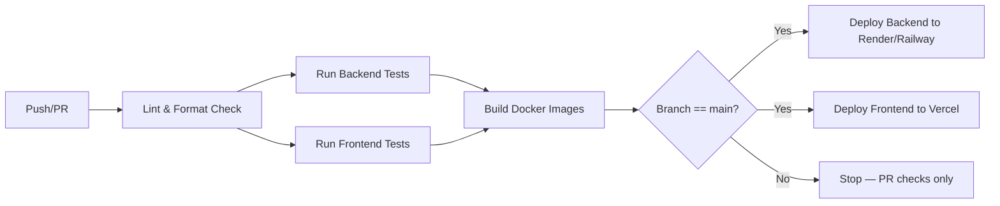

---

## 4. GitHub Actions

`.github/workflows/ci.yml`:
```yaml
name: CI
on:
  pull_request:
  push:
    branches: [main]

jobs:
  backend-test:
    runs-on: ubuntu-latest
    steps:
      - uses: actions/checkout@v4
      - uses: actions/setup-java@v4
        with: { java-version: '17', distribution: 'temurin' }
      - run: cd backend && ./mvnw test

  frontend-test:
    runs-on: ubuntu-latest
    steps:
      - uses: actions/checkout@v4
      - uses: actions/setup-node@v4
        with: { node-version: '18' }
      - run: cd frontend && npm ci && npm test -- --run

  deploy:
    needs: [backend-test, frontend-test]
    if: github.ref == 'refs/heads/main'
    runs-on: ubuntu-latest
    steps:
      - uses: actions/checkout@v4
      - name: Deploy Backend
        run: curl -X POST "${{ secrets.RENDER_DEPLOY_HOOK }}"
      - name: Deploy Frontend
        run: curl -X POST "${{ secrets.VERCEL_DEPLOY_HOOK }}"
```

---

## 5. Environment Variables

| Variable | Used By | Description |
|---|---|---|
| `SPRING_DATASOURCE_URL` | Backend | MySQL JDBC connection string |
| `SPRING_DATASOURCE_USERNAME` | Backend | DB username |
| `SPRING_DATASOURCE_PASSWORD` | Backend | DB password |
| `JWT_SECRET` | Backend | Signing key for JWTs |
| `JWT_ACCESS_EXPIRY` | Backend | Access token TTL (seconds) |
| `JWT_REFRESH_EXPIRY` | Backend | Refresh token TTL (seconds) |
| `CORS_ALLOWED_ORIGINS` | Backend | Comma-separated list of allowed frontend origins |
| `VITE_API_BASE_URL` | Frontend | Backend API base URL |
| `RENDER_DEPLOY_HOOK` | CI | Deploy webhook URL (GitHub secret) |
| `VERCEL_DEPLOY_HOOK` | CI | Deploy webhook URL (GitHub secret) |

All secrets are stored in GitHub Actions encrypted secrets and the hosting platform's environment variable manager — never committed to source control (see [`SECURITY.md`](./SECURITY.md) §11).

---

## 6. Production Deployment

- **Backend:** Containerized Spring Boot app deployed to Render or Railway, auto-deployed on push to `main` via deploy hook.
- **Frontend:** Vite build output deployed to Vercel's global CDN, with automatic preview deployments for pull requests.
- **Database:** Managed MySQL instance (Render/Railway/PlanetScale), automated daily backups with 30-day retention.
- **Domain/SSL:** Managed automatically by Vercel (frontend) and Render/Railway (backend), both enforcing HTTPS.

---

## 7. Monitoring

- Health check endpoint: `GET /actuator/health`, polled by the hosting platform for uptime checks.
- Application metrics exposed via Spring Boot Actuator (`/actuator/metrics`), scraped by Prometheus if configured.
- Frontend error tracking via a lightweight error boundary reporting to a logging endpoint or third-party service (e.g., Sentry).
- Alerting on elevated error rates, latency spikes, or failed deploys (via GitHub Actions notifications + hosting platform alerts).

---

## 8. Rollback Strategy

- Render/Railway retain previous successful deploys; rollback is a one-click action to the last known-good container image.
- Vercel retains all previous deployments; rollback via the Vercel dashboard or CLI (`vercel rollback`).
- Database migrations use a versioned migration tool (Flyway/Liquibase) with reversible migration scripts where feasible, allowing schema rollback alongside application rollback.
- In case of a critical production incident, the CI pipeline supports re-running a deploy from any prior successful commit SHA.

Related: [`ARCHITECTURE.md`](./ARCHITECTURE.md), [`SECURITY.md`](./SECURITY.md), [`TESTING.md`](./TESTING.md)


<div style="page-break-after: always;"></div>

## ANALYTICS

# ANALYTICS.md

# Analytics — HabitFlow

This document explains the calculations and algorithms behind HabitFlow's analytics features.

---

## 1. Habit Score

The **Habit Score** measures consistency for a single habit over a rolling window (default: last 30 days).

```
HabitScore = (completedDays / expectedDays) * 100
```

- `expectedDays` for a `DAILY` habit = number of days in the window since creation (capped at window size).
- `expectedDays` for a `WEEKLY` habit = `targetPerWeek * number of full weeks in window`.
- Score is capped at 100 and rounded to the nearest integer.

**Example:** A daily habit completed 24 out of the last 30 days → `HabitScore = (24/30) * 100 = 80`.

---

## 2. Productivity Score

The **Productivity Score** aggregates performance across *all* active habits into a single 0–100 metric shown on the dashboard.

```
ProductivityScore = weighted average of:
  - 50% recent consistency (last 7 days completion rate across all habits)
  - 30% streak health (average of currentStreak / longestStreak per habit, capped at 1.0)
  - 20% overall habit score average (30-day HabitScore across all habits)
```

```
ProductivityScore = 0.5 * recentConsistency
                   + 0.3 * avgStreakHealth
                   + 0.2 * avgHabitScore
```

All sub-components are normalized to a 0–1 scale before weighting, then multiplied by 100 for the final score.

**Trend indicator:** compares the current week's score to the prior week's score; `up`, `down`, or `flat` if the delta is within ±2 points.

---

## 3. Weekly Analytics

Computed for a given `weekStart` (Monday) → `weekStart + 6 days`.

- Total completions across all habits.
- Total possible completions (sum of expected completions per habit for the week).
- Per-habit breakdown: completions vs. possible.
- Completion rate = `totalCompletions / totalPossible`.

---

## 4. Monthly Analytics

Same structure as weekly analytics, aggregated over a calendar month. Additionally includes:
- Best and worst performing habit of the month (by HabitScore).
- Longest streak achieved during the month across all habits.
- Number of badges earned during the month.

---

## 5. Heatmaps

The heatmap calendar visualizes daily activity intensity, similar to a GitHub contribution graph.

- Each day's **completion rate** = `completions on that day / total active habits for that day`.
- Rendered as a color intensity scale:

| Completion Rate | Color Intensity |
|---|---|
| 0% | Empty/gray |
| 1–33% | Light |
| 34–66% | Medium |
| 67–99% | Strong |
| 100% | Full/darkest |

Data is fetched pre-aggregated from the `GET /analytics/heatmap` endpoint (see [`API.md`](./API.md)) rather than computed client-side, to keep the frontend lightweight.

---

## 6. Charts

| Chart | Data Source | Library |
|---|---|---|
| Weekly completion trend (line chart) | `GET /reports/weekly` (historical weeks) | Recharts |
| Habit breakdown (bar chart) | `GET /reports/weekly` `habitsBreakdown` | Recharts |
| Productivity score gauge | `GET /analytics/productivity-score` | Custom SVG / Recharts RadialBarChart |
| Category distribution (pie chart) | Derived client-side from habit list | Recharts |

---

## 7. KPIs

| KPI | Formula |
|---|---|
| Completion Rate | `completedDays / expectedDays` |
| Consistency Index | `1 - (standardDeviation of daily completion / mean)` — lower variance = higher consistency |
| Streak Health | `currentStreak / longestStreak` (capped at 1.0) |
| Engagement Rate | `daysWithAtLeastOneCompletion / totalDaysInPeriod` |

---

## 8. Calculations — Streak Logic

```
On habit completion for date D:
  if lastCompletedDate == D - 1 day:
      currentStreak += 1
  else if lastCompletedDate == D:
      # already completed, no-op (idempotent)
  else:
      currentStreak = 1   # streak reset

  longestStreak = max(longestStreak, currentStreak)
  lastCompletedDate = D
```

**Weekly habit streak logic** differs slightly — streak increments per week if `targetPerWeek` is met, rather than per day:

```
At end of each week:
  if completionsThisWeek >= targetPerWeek:
      currentStreak += 1
  else:
      currentStreak = 0
  longestStreak = max(longestStreak, currentStreak)
```

---

## 9. Algorithms — Insight Data Preparation

Before the rule engine (see [`AI_INSIGHTS.md`](./AI_INSIGHTS.md)) evaluates rules, the analytics layer prepares a feature set per user:

1. Per-habit completion history (last 30/90 days).
2. Time-of-day distribution of completions (morning/afternoon/evening buckets, derived from `created_at` timestamp of completion records).
3. Day-of-week completion distribution.
4. Streak volatility (number of streak resets in the last 90 days).
5. Category-level aggregate performance.

This feature set is what the rule engine consumes to generate human-readable insights.

Related: [`AI_INSIGHTS.md`](./AI_INSIGHTS.md), [`DATABASE.md`](./DATABASE.md), [`API.md`](./API.md)


<div style="page-break-after: always;"></div>

## AI_INSIGHTS

# AI_INSIGHTS.md

# AI Insights Engine — HabitFlow

HabitFlow's "AI Insights" are generated by a **rule-based engine**, not a machine learning model, in v1. This keeps the system explainable, fast, and free of training-data requirements while still delivering meaningful, personalized feedback. Machine learning is planned for a future version (see Section 5).

---

## 1. How It Works

The `InsightEngine` runs periodically (daily, on dashboard load, or on-demand) and evaluates a user's prepared feature set (see [`ANALYTICS.md`](./ANALYTICS.md) §9) against an ordered set of **rules**. Each rule that matches produces a human-readable message. The top N (typically 3–5) highest-priority matched insights are shown to the user.

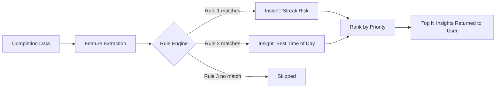

---

## 2. Rules

| Rule ID | Condition | Message Template |
|---|---|---|
| `STREAK_RISK` | Habit not completed today AND yesterday was completed AND currentStreak ≥ 3 | "Your '{habit}' streak may break — complete it today to keep your {streak}-day streak alive." |
| `STREAK_MILESTONE` | currentStreak just crossed 7, 30, 100 | "🎉 You've hit a {n}-day streak on '{habit}'! Keep it going." |
| `BEST_TIME_OF_DAY` | ≥ 70% of completions for a habit occur in one time bucket (morning/afternoon/evening) over last 30 days | "You complete '{habit}' most consistently in the {timeOfDay}." |
| `WEEKEND_DROPOFF` | Completion rate on weekends < 50% of weekday rate | "Your consistency drops on weekends. Consider a lighter weekend goal for '{habit}'." |
| `CATEGORY_STRUGGLE` | A category's average HabitScore < 40 while others are ≥ 70 | "Habits in '{category}' are falling behind your other goals. Want to simplify them?" |
| `RECOVERY_ENCOURAGEMENT` | Streak reset occurred but user resumed within 3 days | "You bounced back quickly after missing '{habit}' — that's what builds long-term consistency." |
| `OVERLOAD_WARNING` | User has ≥ 8 active daily habits AND average HabitScore < 50 | "You may be tracking too many habits at once. Consider focusing on your top 3." |
| `PRODUCTIVITY_TREND_UP` | ProductivityScore increased ≥ 10 points week-over-week | "Your productivity score is up {n} points this week — great momentum!" |
| `INACTIVITY_NUDGE` | No completions logged in 3+ days across all habits | "It's been a few days since your last check-in. A small step today counts." |

---

## 3. Decision Tree (Simplified)

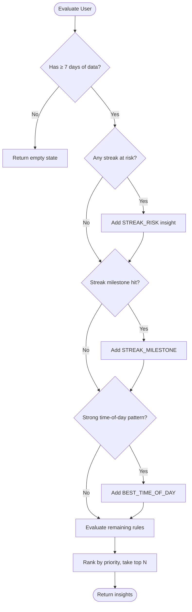

---

## 4. Examples

**Scenario:** Sam has a "Morning Run" habit with a 5-day streak, last completed yesterday, not yet completed today (currently 6 PM).

→ `STREAK_RISK` fires:
> "Your 'Morning Run' streak may break — complete it today to keep your 5-day streak alive."

**Scenario:** Olivia's "Stretching" habit shows 80% of completions logged between 6–8 AM over the last 30 days.

→ `BEST_TIME_OF_DAY` fires:
> "You complete 'Stretching' most consistently in the morning."

**Scenario:** A user is tracking 9 active daily habits with an average HabitScore of 42.

→ `OVERLOAD_WARNING` fires:
> "You may be tracking too many habits at once. Consider focusing on your top 3."

---

## 5. Recommendation Logic

Beyond descriptive insights, a lightweight recommendation layer suggests actions:

| Trigger | Recommendation |
|---|---|
| `OVERLOAD_WARNING` fired | Suggest archiving lowest-performing habits |
| `WEEKEND_DROPOFF` fired | Suggest reducing weekly target or adding a weekend-specific reminder |
| `CATEGORY_STRUGGLE` fired | Suggest breaking the habit into a smaller daily action |
| Repeated `STREAK_RISK` for same habit (3+ times/month) | Suggest changing the reminder time |

Recommendations are surfaced as optional action buttons on insight cards (e.g., "Adjust reminder time →").

---

## 6. Future ML Improvements

Planned evolution beyond rule-based logic (see [`ROADMAP.md`](./ROADMAP.md)):

1. **Personalized reminder timing** — a lightweight model predicting the optimal reminder time per user per habit based on historical completion timestamps, replacing the static time-of-day bucket rule.
2. **Churn prediction** — classify users at risk of app abandonment based on engagement decay patterns, triggering targeted re-engagement flows.
3. **Habit success prediction** — estimate the likelihood a newly created habit will be sustained past 30 days based on similarity to the user's historical habit patterns, offering setup suggestions (e.g., smaller starting frequency).
4. **Clustering-based insight generation** — group users into behavioral cohorts to generate more nuanced, population-informed insights rather than fixed thresholds.
5. **Natural language insight generation** — use an LLM to phrase insights more naturally and contextually, while keeping the underlying rule/feature evaluation deterministic and explainable.

The rule engine is intentionally designed with a clean feature-extraction boundary (see [`ANALYTICS.md`](./ANALYTICS.md) §9) so it can be swapped for or augmented by ML models without redesigning the data pipeline.

Related: [`ANALYTICS.md`](./ANALYTICS.md), [`ROADMAP.md`](./ROADMAP.md), [`API.md`](./API.md)


<div style="page-break-after: always;"></div>

## ROADMAP

# ROADMAP.md

# Roadmap — HabitFlow

## Version 1.0 — MVP (Foundation)

**Goal:** Core habit tracking with basic analytics and authentication.

- [x] JWT Authentication (register/login/refresh)
- [x] User profile management
- [x] Habit CRUD with categories and frequency
- [x] Daily completion tracking
- [x] Streak tracking (current + longest)
- [x] Basic dashboard with today's habits
- [x] Dark mode
- [x] Docker-based local dev environment

**Target Timeline:** Weeks 1–6

---

## Version 2.0 — Analytics & Insights

**Goal:** Deepen engagement through data visibility and feedback.

- [ ] Productivity score
- [ ] Heatmap calendar
- [ ] Weekly & monthly reports
- [ ] Report export (PDF/CSV)
- [ ] Rule-based AI insights engine
- [ ] Achievement badges
- [ ] Reminder system (in-app + email)

**Target Timeline:** Weeks 7–14

---

## Version 3.0 — Scale & Refinement

**Goal:** Production hardening, performance, and polish.

- [ ] Rate limiting & advanced security hardening
- [ ] Caching layer for analytics (Redis)
- [ ] Full accessibility audit (WCAG AA)
- [ ] Performance optimization (Lighthouse ≥ 90)
- [ ] CI/CD maturity: staging environment, automated rollback
- [ ] Public API documentation (Swagger UI polish)
- [ ] Multi-language support (i18n) — initial 2–3 languages

**Target Timeline:** Weeks 15–20

---

## Future Features (Post-V3)

| Feature | Description |
|---|---|
| ML-based insights | Replace/augment rule engine with predictive models (see [`AI_INSIGHTS.md`](./AI_INSIGHTS.md) §6) |
| Social accountability | Friend streaks, shared challenges, leaderboards |
| Native mobile apps | React Native apps for iOS/Android |
| Wearable integrations | Apple Health, Google Fit, Fitbit sync |
| Habit templates marketplace | Community-shared habit templates |
| Team/coaching mode | Organizations and coaches tracking multiple users |
| Push notifications | Native push via FCM/APNs instead of email-only reminders |

---

## Timeline Overview

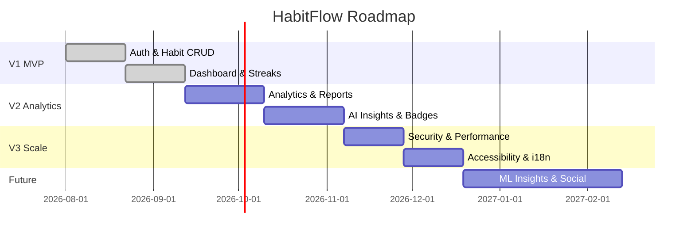

---

## Milestones

| Milestone | Target Date | Success Criteria |
|---|---|---|
| M1: MVP Launch | End of Week 6 | Core habit tracking live in production |
| M2: Analytics Release | End of Week 14 | Reports, insights, badges live |
| M3: Production Hardening Complete | End of Week 20 | Security checklist 100% complete, Lighthouse ≥ 90 |
| M4: 1,000 Active Users | 3 months post-launch | Retention ≥ 40% (per [`PRD.md`](./PRD.md) KPIs) |
| M5: ML Insights Beta | 6 months post-launch | First ML model deployed to a subset of users |

Related: [`PRD.md`](./PRD.md), [`AI_INSIGHTS.md`](./AI_INSIGHTS.md), [`ANALYTICS.md`](./ANALYTICS.md)


<div style="page-break-after: always;"></div>

## DECISIONS

# DECISIONS.md

# Architecture Decision Records (ADRs) — HabitFlow

## ADR-001: Why React?

**Status:** Accepted

**Context:** Needed a frontend framework for a data-heavy, interactive SPA (dashboards, charts, heatmaps).

**Decision:** Use React 18 with TypeScript.

**Rationale:**
- Mature ecosystem for data visualization (Recharts) and server-state management (React Query).
- Component reusability fits HabitFlow's card/widget-heavy UI.
- Large talent pool for future contributors on an open-source project.

**Trade-offs:** More boilerplate than Vue/Svelte for simple state; mitigated by React Query reducing manual state management.

**Alternatives considered:** Vue.js (simpler but smaller ecosystem for our chart/analytics needs), Svelte (excellent performance but less mature ecosystem at time of decision).

---

## ADR-002: Why Spring Boot?

**Status:** Accepted

**Context:** Needed a backend framework capable of secure, maintainable REST APIs with strong ORM and security integration.

**Decision:** Use Spring Boot 3 (Java 17+).

**Rationale:**
- Spring Security provides battle-tested JWT/auth handling out of the box.
- Spring Data JPA significantly reduces repository boilerplate.
- Enterprise-proven for long-term maintainability by multiple contributors (important for an open-source project expecting community contributions).
- Strong typing (Java) reduces runtime errors in business-critical logic (streak/score calculations).

**Trade-offs:** More verbose than Node.js/Express; slower initial development velocity than a JS-only stack.

**Alternatives considered:** Node.js/NestJS (faster to prototype, shared language with frontend), Django/FastAPI (great for rapid development, weaker typing story than Java for this team's preference).

---

## ADR-003: Why MySQL?

**Status:** Accepted

**Context:** HabitFlow's domain is inherently relational — users, habits, completions, streaks with clear foreign-key relationships and a need for aggregate analytics queries.

**Decision:** Use MySQL 8.x as the primary datastore.

**Rationale:**
- ACID compliance ensures data integrity for streak/completion records where duplicate/lost writes would corrupt user trust in their data.
- Mature indexing support for the range queries analytics relies on (see [`DATABASE.md`](./DATABASE.md)).
- Wide, low-cost hosting availability (Render, Railway, PlanetScale).

**Trade-offs:** Less flexible schema evolution than a document store; acceptable given the well-defined, stable domain model.

**Alternatives considered:** PostgreSQL (comparable, richer feature set — a reasonable alternative, chosen against mainly for team familiarity and hosting simplicity), MongoDB (poor fit for relational, join-heavy analytics queries).

---

## ADR-004: Why JWT?

**Status:** Accepted

**Context:** Needed an authentication mechanism compatible with a decoupled SPA + REST API architecture, deployable across independently scaled services.

**Decision:** Use JWT (access + refresh token pattern) via Spring Security.

**Rationale:**
- Stateless — no server-side session store required, simplifying horizontal scaling of the backend.
- Well-supported in both Spring Security and the frontend Axios interceptor pattern.
- Refresh token rotation mitigates the primary weakness (token revocation difficulty) of pure JWT approaches.

**Trade-offs:** Token revocation is harder than session-based auth; mitigated via short access-token TTL and refresh rotation. See [`SECURITY.md`](./SECURITY.md) for full mitigation strategy.

**Alternatives considered:** Server-side sessions with Redis (simpler revocation, but adds statefulness that complicates horizontal scaling), third-party auth providers like Auth0/Clerk (faster to implement, but adds external dependency and cost for an open-source project).

---

## ADR-005: Why Layered Architecture?

**Status:** Accepted

**Context:** Needed a backend structure that's approachable for open-source contributors of varying experience levels while remaining maintainable long-term.

**Decision:** Use a classic Layered Architecture (Controller → Service → Repository) with DTO and Repository patterns.

**Rationale:**
- Clear separation of concerns makes it easy for new contributors to know where to add code (see [`BACKEND.md`](./BACKEND.md)).
- Well-understood pattern in the Spring ecosystem, minimizing onboarding friction.
- DTOs decouple the public API contract from internal persistence models, allowing each to evolve independently.

**Trade-offs:** Can lead to anemic domain models if business logic isn't disciplined into the service layer; mitigated through code review standards in [`CODING_STANDARDS.md`](./CODING_STANDARDS.md).

**Alternatives considered:** Hexagonal/Clean Architecture (more flexible for complex domains, but adds abstraction overhead not justified at HabitFlow's current scale), Domain-Driven Design with aggregates (over-engineered for the current bounded context size).

---

## ADR-006: Why REST over GraphQL?

**Status:** Accepted

**Context:** Needed an API style for communication between the React frontend and Spring Boot backend.

**Decision:** Use REST (resource-oriented) APIs.

**Rationale:**
- HabitFlow's data access patterns are relatively fixed and well-known upfront (dashboard, habit list, analytics) — GraphQL's flexible querying provides less benefit at this stage.
- REST is simpler to secure, cache, rate-limit, and document (OpenAPI/Swagger) with Spring Boot's built-in tooling.
- Lower learning curve for open-source contributors unfamiliar with GraphQL schema design.

**Trade-offs:** Some over-fetching/under-fetching on complex dashboard views; mitigated by purpose-built aggregate endpoints (e.g., `/analytics/heatmap`) rather than generic CRUD-only endpoints.

**Alternatives considered:** GraphQL (better for flexible, client-driven queries — worth revisiting if the frontend's data needs become significantly more dynamic, e.g., with a future mobile app requiring different data shapes).

---

## ADR-007: Why Rule-Based AI Insights (Not ML) for V1

**Status:** Accepted

**Context:** Needed to deliver "intelligent" behavioral feedback without requiring a trained model, labeled data, or ML infrastructure for the initial release.

**Decision:** Implement insights via a deterministic rule engine (see [`AI_INSIGHTS.md`](./AI_INSIGHTS.md)).

**Rationale:**
- Fully explainable — every insight can be traced to a specific, understandable condition, which builds user trust.
- No cold-start problem — works for new users with minimal data (unlike most ML approaches).
- Faster to ship and iterate on based on direct user feedback about which insights are useful.

**Trade-offs:** Less personalized/adaptive than a true ML model; explicitly planned as a future evolution (see [`AI_INSIGHTS.md`](./AI_INSIGHTS.md) §6 and [`ROADMAP.md`](./ROADMAP.md)).

**Alternatives considered:** Third-party ML/AI API integration (adds cost and external dependency misaligned with an open-source project's goals at MVP stage).

Related: [`ARCHITECTURE.md`](./ARCHITECTURE.md), [`TECH_STACK.md`](./TECH_STACK.md), [`AI_INSIGHTS.md`](./AI_INSIGHTS.md)


<div style="page-break-after: always;"></div>

## CODING_STANDARDS

# CODING_STANDARDS.md

# Coding Standards — HabitFlow

## 1. Java Standards

- Follow the **Google Java Style Guide** (2-space indentation, 100-char line limit).
- Use `final` for variables that aren't reassigned.
- Prefer constructor injection (`@RequiredArgsConstructor` via Lombok) over field injection.
- Services must not contain HTTP-specific logic (no `HttpServletRequest` handling in services).
- Use `Optional<T>` for repository methods that may return no result; avoid returning `null`.
- Records (`record HabitRequestDTO(...)`) preferred for immutable DTOs (Java 17+).
- Avoid catching generic `Exception`; catch specific exceptions and rethrow as domain exceptions where appropriate.

```java
// Good
public Optional<Habit> findActiveHabit(Long id) {
    return habitRepository.findByIdAndArchivedFalse(id);
}

// Avoid
public Habit findActiveHabit(Long id) {
    return habitRepository.findById(id).orElse(null); // null-prone
}
```

---

## 2. React Standards

- Functional components only; no class components.
- One component per file; file name matches component name (`HabitCard.tsx` exports `HabitCard`).
- Props typed via explicit `interface` or `type`, never `any`.
- Prefer composition over prop-drilling more than 2 levels deep — use context or component composition instead.
- Side effects isolated in `useEffect` with correct dependency arrays; avoid effect-based derived state where a computed value would do.
- Custom hooks prefixed with `use` and placed in `/hooks`.

```tsx
// Good
interface HabitCardProps {
  habit: Habit;
  onComplete: (id: number) => void;
}

export function HabitCard({ habit, onComplete }: HabitCardProps) {
  return (
    <div className="rounded-lg p-4 shadow-sm">
      <h3>{habit.name}</h3>
      <button onClick={() => onComplete(habit.id)}>Complete</button>
    </div>
  );
}
```

---

## 3. Naming Conventions

| Element | Convention | Example |
|---|---|---|
| Java classes | PascalCase | `HabitService` |
| Java methods/variables | camelCase | `calculateStreak()` |
| Java constants | UPPER_SNAKE_CASE | `MAX_LOGIN_ATTEMPTS` |
| React components | PascalCase | `HeatmapCalendar.tsx` |
| React hooks | camelCase, `use` prefix | `useHabits.ts` |
| TS types/interfaces | PascalCase | `HabitResponseDTO` |
| CSS/Tailwind custom classes | kebab-case | `habit-card-active` |
| Database tables | snake_case, plural | `habit_completions` |
| Database columns | snake_case | `current_streak` |

---

## 4. Folder Naming

- Backend packages: lowercase, singular where representing a layer (`controller`, `service`, `dto`), matching Java package conventions.
- Frontend folders: lowercase, feature-based (`components/habit`, `components/analytics`).
- Test files mirror source structure: `HabitServiceTest.java` next to `HabitService.java` conceptually (in `src/test/java/...`); `HabitCard.test.tsx` colocated with `HabitCard.tsx`.

---

## 5. API Naming

- Resource-oriented, plural nouns: `/habits`, `/reports`, `/insights`.
- Nested resources for sub-actions: `POST /habits/{id}/complete` rather than `/complete-habit`.
- Use HTTP methods semantically: `GET` (read), `POST` (create), `PUT` (full update), `PATCH` (partial update, if needed), `DELETE` (remove).
- Query parameters in camelCase: `?weekStart=2026-07-14`.
- Versioning reserved for future breaking changes: `/api/v2/...` (currently unversioned `/api/...` for v1).

---

## 6. Error Handling

- **Backend:** All exceptions funnel through `GlobalExceptionHandler` (see [`BACKEND.md`](./BACKEND.md) §7); never let raw stack traces reach the client.
- **Frontend:** API errors caught centrally in the Axios response interceptor, surfaced via a consistent `Toast` component; component-level `try/catch` only for flows requiring specific recovery behavior.
- Error messages shown to users must be human-readable and actionable, never raw exception messages or stack traces.
- Never swallow exceptions silently — at minimum, log at `WARN` or `ERROR`.

---

## 7. Logging

- Use SLF4J (`private static final Logger log = LoggerFactory.getLogger(HabitService.class);`) — never `System.out.println`.
- Log at appropriate levels: `ERROR` (unexpected failures), `WARN` (recoverable issues, auth failures), `INFO` (key business events), `DEBUG` (verbose tracing, disabled in production).
- Never log sensitive data: passwords, JWTs, full request bodies containing PII.
- Frontend: use a centralized logging utility instead of scattered `console.log`; remove/guard debug logs before production builds.

---

## 8. Documentation Standards

- Every public backend method with non-obvious behavior includes a Javadoc comment explaining intent (not restating the signature).
- Every exported React component/hook includes a brief JSDoc comment if its purpose isn't self-evident from its name and props.
- API changes must be reflected in [`API.md`](./API.md) in the same PR.
- Architectural changes must be reflected in [`ARCHITECTURE.md`](./ARCHITECTURE.md) and, if a significant trade-off was made, recorded as a new ADR in [`DECISIONS.md`](./DECISIONS.md).
- README and setup instructions must be kept in sync with actual `package.json`/`pom.xml` scripts — verified as part of PR review for any tooling changes.

Related: [`CONTRIBUTING.md`](./CONTRIBUTING.md), [`BACKEND.md`](./BACKEND.md), [`FRONTEND.md`](./FRONTEND.md)


