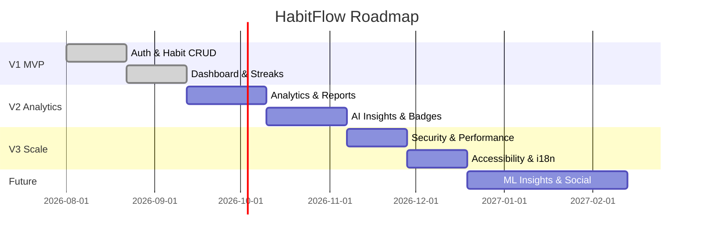

# ROADMAP.md

# Roadmap — HabitFlow

## Version 1.0 — MVP (Foundation)

**Goal:** Core habit tracking with basic analytics and authentication.

- [x] JWT Authentication (register/login/refresh)
- [x] User profile management
- [x] Habit CRUD with categories and frequency
- [x] Daily completion tracking
- [x] Streak tracking (current + longest)
- [x] Basic dashboard with today's habits
- [x] Dark mode
- [x] Docker-based local dev environment

**Target Timeline:** Weeks 1–6

---

## Version 2.0 — Analytics & Insights

**Goal:** Deepen engagement through data visibility and feedback.

- [ ] Productivity score
- [ ] Heatmap calendar
- [ ] Weekly & monthly reports
- [ ] Report export (PDF/CSV)
- [ ] Rule-based AI insights engine
- [ ] Achievement badges
- [ ] Reminder system (in-app + email)

**Target Timeline:** Weeks 7–14

---

## Version 3.0 — Scale & Refinement

**Goal:** Production hardening, performance, and polish.

- [ ] Rate limiting & advanced security hardening
- [ ] Caching layer for analytics (Redis)
- [ ] Full accessibility audit (WCAG AA)
- [ ] Performance optimization (Lighthouse ≥ 90)
- [ ] CI/CD maturity: staging environment, automated rollback
- [ ] Public API documentation (Swagger UI polish)
- [ ] Multi-language support (i18n) — initial 2–3 languages

**Target Timeline:** Weeks 15–20

---

## Future Features (Post-V3)

| Feature | Description |
|---|---|
| ML-based insights | Replace/augment rule engine with predictive models (see [`AI_INSIGHTS.md`](./AI_INSIGHTS.md) §6) |
| Social accountability | Friend streaks, shared challenges, leaderboards |
| Native mobile apps | React Native apps for iOS/Android |
| Wearable integrations | Apple Health, Google Fit, Fitbit sync |
| Habit templates marketplace | Community-shared habit templates |
| Team/coaching mode | Organizations and coaches tracking multiple users |
| Push notifications | Native push via FCM/APNs instead of email-only reminders |

---

## Timeline Overview

---

## Milestones

| Milestone | Target Date | Success Criteria |
|---|---|---|
| M1: MVP Launch | End of Week 6 | Core habit tracking live in production |
| M2: Analytics Release | End of Week 14 | Reports, insights, badges live |
| M3: Production Hardening Complete | End of Week 20 | Security checklist 100% complete, Lighthouse ≥ 90 |
| M4: 1,000 Active Users | 3 months post-launch | Retention ≥ 40% (per [`PRD.md`](./PRD.md) KPIs) |
| M5: ML Insights Beta | 6 months post-launch | First ML model deployed to a subset of users |

Related: [`PRD.md`](./PRD.md), [`AI_INSIGHTS.md`](./AI_INSIGHTS.md), [`ANALYTICS.md`](./ANALYTICS.md)
